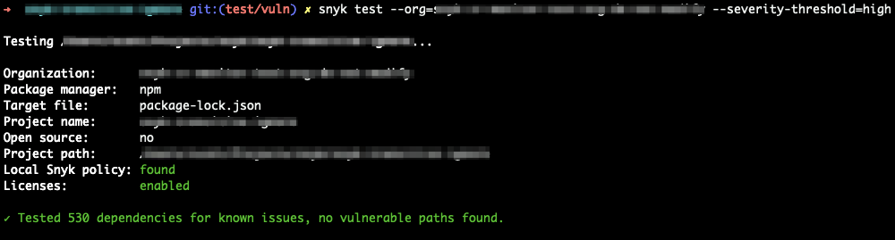

# Advanced failing of builds in Snyk CLI

The Snyk CLI provides the following options when failing your builds:

```
--severity-threshold=low|medium|high|critical
```

Only report vulnerabilities of provided level or higher.

```
--fail-on=all|upgradable|patchable
```

Only fail when there are vulnerabilities that can be fixed.

```
--fail-on=all
```

Fail when there is at least one vulnerability that can be either upgraded or patched.

```
--fail-on=upgradable
```

Fail when there is at least one vulnerability that can be upgraded.

```
--fail-on=patchable
```

Fail when there is at least one vulnerability that can be patched. If vulnerabilities do not have a fix and this option is being used, tests pass.

The Snyk CLI on its own does not have the capability natively to fail tests on more complex use cases. Here are some ways to achieve more complex pass/fail criteria.

## Combining security policies with --severity-threshold

[Security policies](https://docs.snyk.io/fixing-and-prioritizing-issues/policies) provide the capability to change the severity of a vulnerability if the severity matches specific criteria when a project is tested against an organization using that policy. You could, for example, change the severity of a vulnerability from high to low, and if you run `snyk test` with the CLI with

```
 --severity-threshold=medium|high
```

this previously high severity vulnerability no longer fails the build.


Security policies do not have all attributes available for criteria matching. Refer to the security policy configuration to see what is available as it is added to over time.


Here is an example of `snyk test` using `--severity-threshold=high` running against a default organization with no policy applied to it.


Here is an example `snyk test` using `--severity-threshold=high` running against an organization with a policy that downgrades this particular vulnerability severity to `low`. There are no vulnerabilities found.



## Companion tools

The following discusses use of snyk-delta or snyk-filter, open source companion tools for the Snyk CLI.

snyk-delta finds the delta of vulnerabilities between the current test and a previously monitored snapshot.

snyk-delta is available from npmjs.org, and may be pulled into your CI/CD pipeline using

```
npm install -g snyk-delta
```

snyk-filter provides for user-defined pass/fail criteria based on any available data in the `snyk test` JSON output.

snyk-filter is available from npmjs.org and may be pulled into your CI/CD pipeline using npm install

```
npm install -g snyk-filter
```

### Fail current build only if new vulnerabilities are being introduced

#### Inline mode

```
snyk test --json --print-deps | snyk-delta
```

Possibly point to a specific snapshot by specifying org + project coordinates

```
snyk test --json --print-deps | snyk-delta --baselineOrg xxx --baselineProject xxx
```

#### Standalone

```
snyk-delta --baselineOrg xxx --baselineProject xxx --currentOrg xxx --currentProject xxx
```

Refer to the [snyk-delta project on GitHub](https://github.com/snyk-tech-services/snyk-delta) for more information.

### Fail build for CVSS score higher than ...

```
snyk test --json | snyk-filter -f /path/to/example-cvss-9-or-above.yml
```

### Custom criteria and filtering

snyk-filter can utilize any combination of criteria available in the `snyk test` JSON output.

You may also have different criteria for display from what will fail the build. This allows you to do things like display all vulnerabilities in the test output, while failing only on some specific criteria.

Refer to the [snyk-filter project on GitHub](https://github.com/snyk-tech-services/snyk-filter) for examples and more information.
