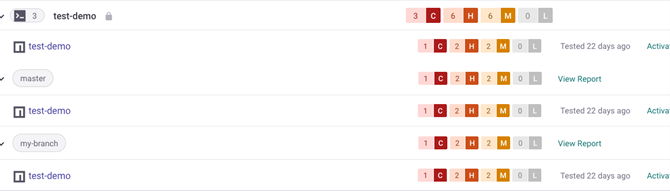

# Separating projects by branch or version


This feature is currently in Open Beta. There are areas where it is not fully supported. Currently [Snyk Open Source](../../products/snyk-open-source/) is supported.


Your project may have multiple states which you want to monitor separately, for example, branches, releases, or deployments. You can use the `--target-reference` option to separate projects into these specific groupings.

`--target-reference` takes any text so you can combine it with a command to automatically set it to a value. Examples follow.

Set `--target-reference` to the current Git branch.

```
snyk monitor --target-reference="$(git branch --show-current)"
```

Use the latest Git tag.

```
snyk monitor --target-reference="$(git describe --tags --abbrev=0)"
```

You can adjust the option for the developer tools used in your project. Any valid Git target can be used.

`--target-reference` allows you to create sub-groupings on the Projects page.


