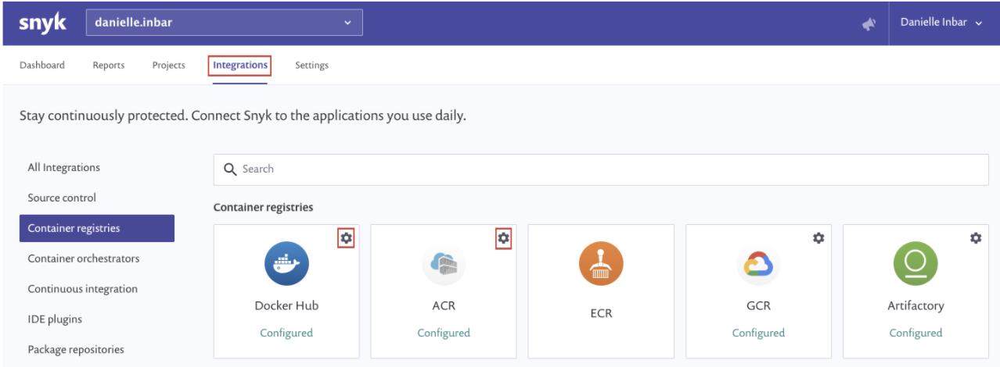

# Detecting application vulnerabilities in container images

The feature is currently supported for Node, Ruby, PHP, Python, Go binaries and Java.

Snyk allows detection of vulnerabilities in your application dependencies from container images, as well as from the operating system, all in one single scan.

After you integrate with a container registry and import your projects, we scan your image and test for vulnerabilities.

## Enable application vulnerabilities scan from container images

1. Navigate to your container registry integration settings

   

2. Enable the _**Detect application vulnerabilities**_ capability and save the changes:

   

## View vulnerabilities and licensing issues

After the feature is enabled, you can see:

* Dependency vulnerabilities and licensing issues of manifest files detected in your container image.
* Vulnerabilities detected in operating system packages.

When an image is imported to Snyk, it appears under its registry record in the **Projects** view, showing the operating system vulnerabilities found in your image.

With this feature enabled, you can also see nested manifest files detected in the image and their vulnerabilities and licensing issues.

Snyk scans the image regularly based on your project’s settings, and updates you via email or Slack - based on your configuration - when any new vulnerabilities are identified in both the operating system and application dependencies.

For each project, you can choose the test frequency under its settings \(the default is daily testing\).

