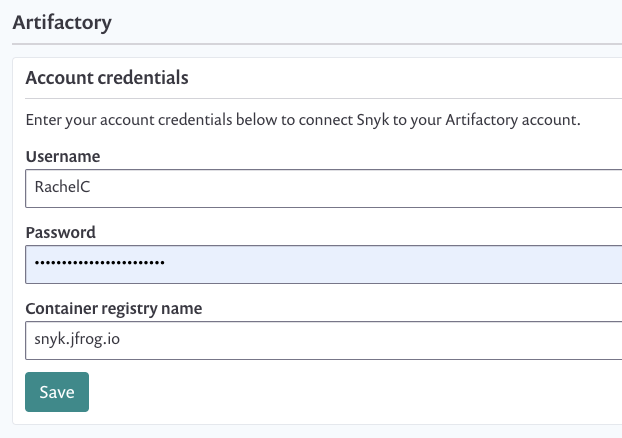

# Configuring your JFrog Artifactory container registry integration

Enable integration between one Artifactory instance as a container registry and a Snyk organization to start managing your image security.

### Prerequisites

* You must be an administrator for the organization you're configuring in Snyk.
* Snyk needs user credentials to integrate with Artifactory and does not support Artifactory when configured for single sign-on \(SSO\).
* If you're using self-hosted Artifactory, refer to our documentation explaining about [broker configuration](https://snyk.gitbook.io/user-docs/snyk-container/integrate-self-hosted-container-registries/snyk-integration-to-self-hosted-container-registries-Snyk-integration-to-self-hosted-container-registries). 

### Configure integration

1. Log in to [your Snyk account](https://app.snyk.io/).
2. Navigate to **Integrations** from the menu bar at the top, find and click the Artifactory option:

   

3. The configuration page in the **Settings** area loads.
4. Enter credentials as follows: 
   1. **Username and Password**—use your Artifactory login credentials. 
   2. **Container registry name -** the _full URL_ for the registry you’d like to integrate with.
5. Click **Saved**.

Snyk tests the connection values and the page reloads, now displaying integration details as you entered them. A confirmation message that the details were saved also appears in green at the top of the screen. In addition, if the connection failed, a notification appears.

