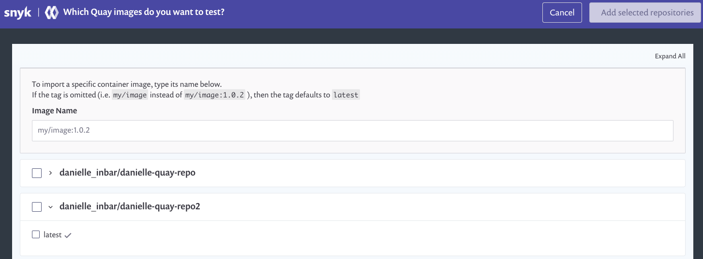
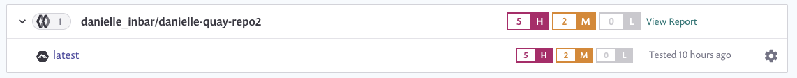

# Scan container images from Quay in Snyk

Snyk tests and monitors your Quay container images by evaluating its tags in your repositories. Once imported to Snyk, your image vulnerabilities are surfaced and can be triaged easily.

To add images from Quay to Snyk:

**Prerequisites**:

* Have a Snyk account with access to the relevant organization \(given by an administrator\).
* Quay integration configured. To learn more about that, follow the steps in [Container security with Quay integration](https://support.snyk.io/hc/en-us/articles/360018445398)

**Steps:**

1. Log in to your account and navigate to the relevant group and organization that you want to manage.

1. Under the **Projects** tab, click **Add project**. The list of integrations already configured on your account opens. Select the **Quay** option or **Other** if **Quay** doesn’t appear.
2. The **Which images do you want to test?** view appears, displaying all of the available images for your connected registry, grouped by each of your repositories, similar to the following:

1. Select single or multiple images to be imported to Snyk. Selection can be done by choosing a specific image or selecting an entire repository. You can also search by image name to find specific images to import. To finish, click **Add selected repositories** on the top-right. 5. A status bar appears at the top of the page as the images are imported; you can continue working in the meantime. 6. When the import ends:

* You can view the newly imported image in the **Projects** page \(marked with a **NEW** tag\). Images are grouped by repository and are each linked individually to a detailed **Project** page.
  * An **import log** becomes available and can be reached at the top of the projects list. 
* To enrich the data and get recommendations regarding your base image, you can connect your Dockerfile to the image project, under **Settings**. For more info, see [Adding your Dockerfile and test your base image](https://support.snyk.io/hc/articles/360003916218#UUID-9ab347a6-8af0-ef6c-5ebd-cec21fbfab29).

Quay imports are indicated with a unique icon, and you can also filter the integration in the **projects** view to see Quay projects only:

