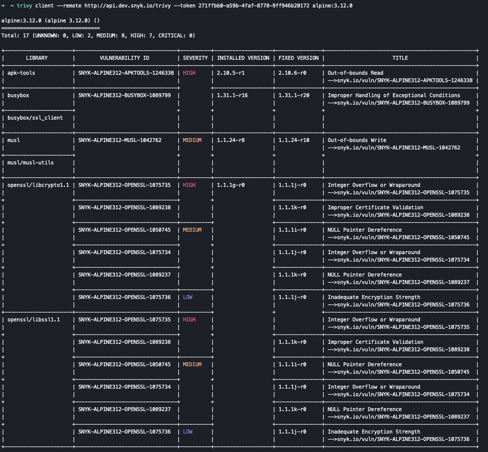

# Scan images with Trivy and get results from Snyk

Trivy is an open-source vulnerability scanner that detects OS packages as well as application dependencies in container images.  
Snyk integrates with Trivy in such a way that if you are a Trivy user, you can scan your images using it and get the scan results from Snyk, by accessing its vulnerability database intel.

**Prerequisites**

* Have Trivy Client [installed](https://aquasecurity.github.io/trivy/v0.18.3/installation/)
* The Trivy version should be v0.18.3 with an [Apache License 2.0](https://github.com/aquasecurity/trivy/blob/main/LICENSE).

**Usage**

Scan an image using Trivy Client command

```text
trivy client --remote http://api.snyk.io/trivy --token
```

Once running the above command with the desired image to scan, Snyk results are displayed as the output, demonstrating the issues and in which version they were fixed.



## **Supported CLI options**

| `--format, -f` | Determines the output format. Possible values are `json` and `table`. Default format is table view. |
| :--- | :--- |
| `--severity, -s` | Severities of vulnerabilities to be displayed. Default value is: "UNKNOWN,LOW,MEDIUM,HIGH,CRITICAL". |
| `--help, -h` | Shows help options. Default is false. |

### Note

Trivy supports [**TEMP**](https://security-tracker.debian.org/tracker/data/fake-names) vulnerabilities, whereas Snyk only supports **CVE** vulnerabilities, so you might see differences in the output between the two tools.

