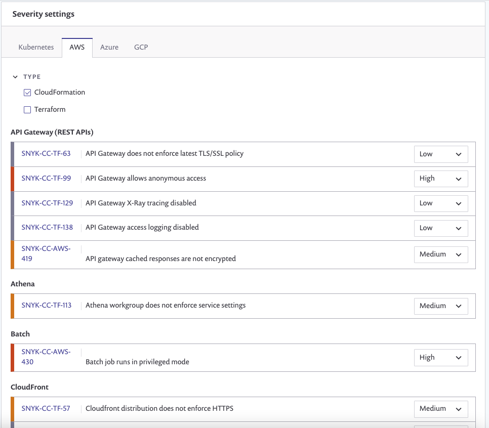

# Configure your integration to find security issues in your CloudFormation files

Snyk tests and monitors CloudFormation files from source code repositories. It gives advice on how to better secure cloud environments by catching misconfigurations before they are pushed to production along with assistance on how best to fix them.

## Supported Git repositories and file formats

Snyk currently scans CloudFormation files in `JSON` and `YAML` format when imported from an integrated Git repository. Scan a CloudFormation module repository by either importing the repo that holds the module from an SCM or by using the directory itself with the `snyk iac test` command.

Scanning CloudFormation provides security feedback on everything that is statically configured in the module. To benefit from recurring/scheduled testing, it's best practice to import custom modules directly from an SCM.

## Configure Snyk to scan your CloudFormation configuration files

**Prerequisites**

* You must be an administrator for the organization you're configuring in Snyk.
* Ensure you’ve already integrated your Git repository; if you haven’t done this yet, check out the [Git repository \(SCM\) integrations](https://support.snyk.io/hc/en-us/sections/360001138098-Git-repository-SCM-integrations).

**Configure Snyk**

1. Enable Snyk to detect Infrastructure as code files as follows:
   1. **Note**: Integrations are managed per organization. 
2. If needed, review and adjust settings in the **Infrastructure as code** settings area:

