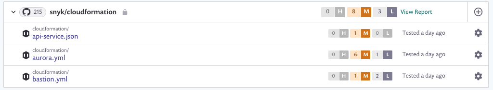
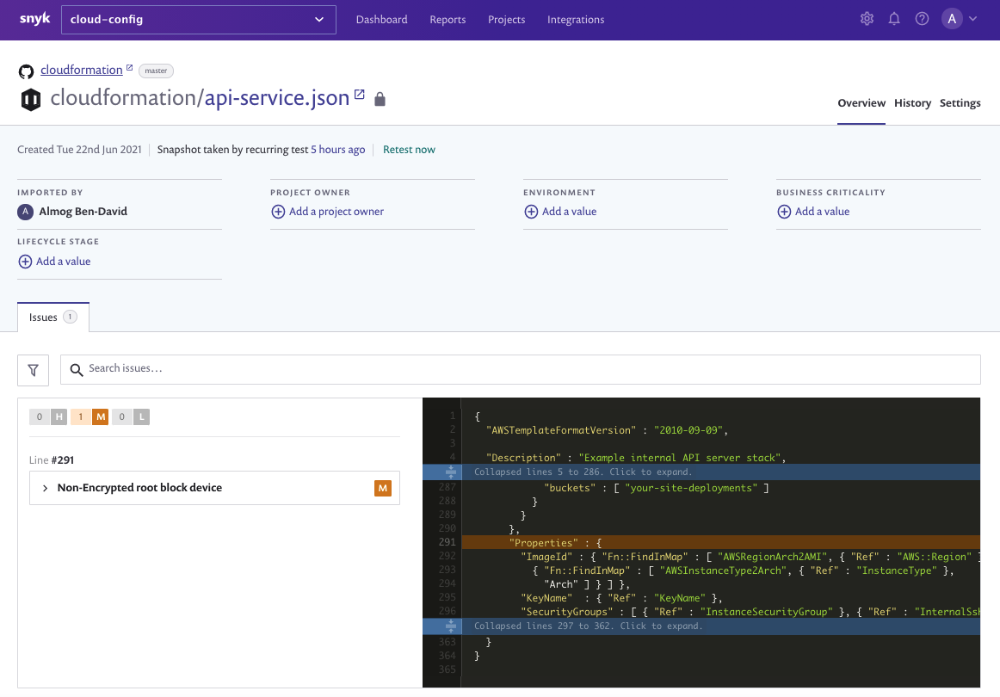

# Scan and fix security issues in your CloudFormation files

Snyk scans CloudFormation code for misconfigurations and security issues. For configuration files, once scanned, Snyk reports on any misconfigurations based on the settings administrators implement and makes recommendations for fixes accordingly.

### **Prerequisites**

* An administrator integrates the organization with a preferred Git repository and enables the detection of configuration files as described in [Configure your integration to find security issues in your CloudFormation files](https://docs.snyk.io/snyk-infrastructure-as-code/scan-cloudformation-files/configure-your-integration-to-find-security-issues-in-your-cloudformation-files).
* The Snyk account and CloudFormation files will be in `JSON` and `YAML` formats.

## Scan and fix configuration files

* Log in to the account and navigate to the relevant group and organization.

* Re-import repositories if testing occurred before the infrastructure as code feature was enabled in order to detect the CloudFormation code:

 

* Every time a repository is scanned:
  * Every CloudFormation file is imported as a separate project, grouped together per repository, similar to this example:

   

  * If the repository was re-imported: in order to then import the CloudFormation files, Snyk imports and re-tests the existing application manifest files--displaying the test time as "now".
* Click a project link to view the scan results and to help view details on the CloudFormation code:

