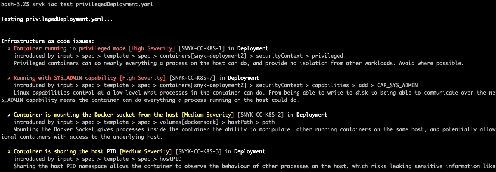
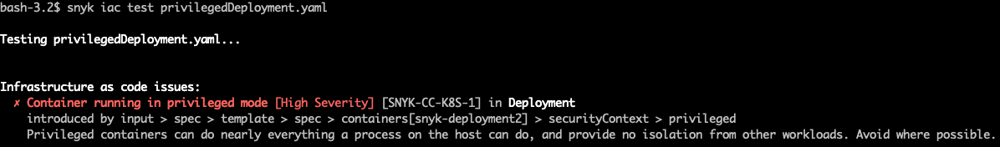
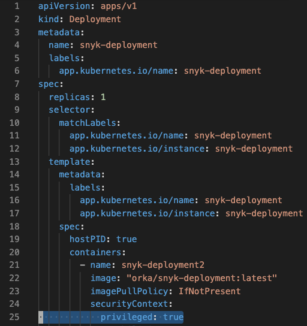

# Understanding configuration scan issues

Snyk analyzes your provided configuration file for issues and provides advice on how to resolve the issue directly from the CLI.

For example - scanning a Kubernetes file

```text
snyk iac test privilegedDeployment.yaml
```

could give an output as follows



This example is of output from a Kubernetes file, but this guide applies to any file format including Terraform.

### List of vulnerabilities—sorted by severity, where each is detailed as follows:

**A clear heading line** - specifying the issue that has been detected, the severity of that issue and the Snyk code for that particular issue

**Location** - the path at which the issue has been identified. See below for a detailed example.

**Description** - an explanation of the issue and its associated impact

### **As an example:**



The path of this issue is specified as

```text
 input > spec > template > spec > containers[snyk-deployment2] > securityContext > privileged
```

In this screenshot you can see the highlighted line represents the identified issue.



