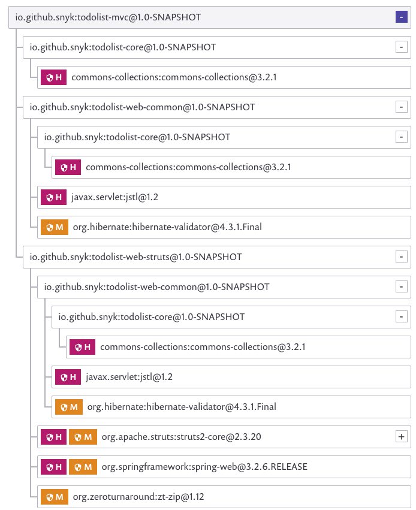

# Snyk for .NET

Snyk offers security scanning to test your projects for vulnerabilities, both through your CLI and through different integrations from our UI.

The following describes how to use Snyk to scan your .NET projects:



---
**NOTE**  
Features might not be available, depending on your subscription plan.

---


|  | Package managers/Features | CLI support | Git support | License scanning | Remediation | Runtime monitoring |
| :--- | :--- | :--- | :--- | :--- | :--- | :--- |
|  | [NuGet](https://www.nuget.org/) | ✔︎ | ✔︎ | ✔︎ |  |  |
|  | [Paket](https://fsprojects.github.io/Paket/index.html) | ✔︎ |  | ✔︎ |  |  |

### **How it works**

Once we’ve built the tree, we can use our [vulnerability database ](https://snyk.io/vuln)to find vulnerabilities in any of the packages anywhere in the dependency tree.


In order to scan your dependencies, you must ensure you have first installed the relevant package manager, and that your project contains the supported manifest files


The way by which Snyk analyzes and builds the tree varies depending on the language and package manager of the project, as well as the location of your project:

* [Snyk CLI tool for .NET projects](https://support.snyk.io/hc/en-us/articles/360004519138-Snyk-for-NET#UUID-7a77a8d4-315a-fdb0-242b-d65dd8354eef)
* [Git services for .NET projects](https://support.snyk.io/hc/en-us/articles/360004519138-Snyk-for-NET#UUID-69fbe5a6-a24a-d5ad-5d54-cd18ef6786b3)

## Snyk CLI tool for .NET projects

### Dependencies managed by PackageReference

First, restore dependencies in the .NET project by running `dotnet restore` and make sure **obj/project.assets.json** has been created by the previous command, run `snyk test`. For more information on building projects, check out [Getting started with the CLI](https://support.snyk.io/hc/en-us/articles/360003812458).

Examples of supported project files that resolve into **project.assets.json** include:

* \*.csproj 
* \*.vbproj
* \*.fsproj

---
**NOTE**

Project files can be combined with [lock files](https://docs.microsoft.com/en-us/nuget/consume-packages/package-references-in-project-files#locking-dependencies) for a more deterministic **project.assets.json** resolution

---

### Dependencies managed by packages.config

Whilst there are two approaches for dependencies managed by **packages.config**, the following is the recommended approach as this will yield the most accurate results:

First, install the dependencies into the **packages** folder by running `nuget install -OutputDirectory packages` and make sure the **packages** dir has been created by the previous command, run `snyk test`.

Examples of supported project files that resolve into **packages** include:

* packages.config

---
**NOTE**
While you should also be able to run `snyk test` without previously installing dependencies this will result in less accurate vulnerability results

---

### Dependencies managed by Paket

To use Paket a **paket.lock** file is required in combination with a **paket.dependencies** file. Run `snyk test`

Other support includes: **project.json** \(no longer recommended, please refer to [Microsoft documentation](https://docs.microsoft.com/en-us/nuget/archive/project-json)\)

#### Nuget

Follow the same instructions as [Snyk CLI tool for .NET projects](snyk-for-.net.md)

#### Paket

In order to build the dependency tree, Snyk analyzes the **paket.dependencies** and **paket.lock** files.

#### **CLI parameters for .NET**

This section describes the unique CLI options available when working with .NET-based projects.

**Prerequisites**

* Best practice dictates that the project be fully built so the installed packages can be analyzed. While manifest files provide most of the information on which dependencies the project uses--some dependencies may only resolve after the project build is complete. Depending on specific use cases, the **packages** folder & build artifacts are also analyzed.
* When running Snyk test, we test the first manifest file we find. If you want to check all of the .NET manifest files included in a single solution--use the **--file** parameter, similar to the following:

  ```text
  $ snyk test --file=myApp.sln
  ```

  * Ensure you've installed the relevant package manager before you begin using the Snyk CLI tool.
  * Ensure you've included the relevant manifest files supported by Snyk before testing.
  * Install and authenticate the Snyk CLI to start analyzing projects from your local environment. Read more about our CLI in [Getting started with the CLI](https://support.snyk.io/hc/articles/360003812458#UUID-6d3e2b39-daa0-f2f1-19d2-b9107b678c81) as well.

#### **Parameters** 

<table>
  <thead>
    <tr>
      <th style="text-align:left">Option</th>
      <th style="text-align:left">Description</th>
    </tr>
  </thead>
  <tbody>
    <tr>
      <td style="text-align:left"><code>--assets-project-name</code>
      </td>
      <td style="text-align:left">When monitoring a .NET project using NuGet, the <code>PackageReference</code> key
        uses the project name that is indicated in the project.assets.json.</td>
    </tr>
    <tr>
      <td style="text-align:left"><code>--packages-folder</code>
      </td>
      <td style="text-align:left">
        <p>This is the folder in which your dependencies are installed. If you&#x2019;ve
          assigned a unique name to this folder, then Snyk can only find it if you
          enter a custom path.</p>
        <p>Use the absolute or relative path, including the name of the folder where
          your dependencies reside.</p>
      </td>
    </tr>
    <tr>
      <td style="text-align:left"><code>--file=.sln</code>
      </td>
      <td style="text-align:left">Test all .NET projects included in the given <code>.sln</code> file</td>
    </tr>
    <tr>
      <td style="text-align:left"><code>--file=packages.config</code>
      </td>
      <td style="text-align:left">Test an individual .NET project.</td>
    </tr>
  </tbody>
</table>

### Git services for .NET projects

.NET projects can be imported from any of the Git services we support.

Once imported, Snyk analyzes your projects based on their supported manifest files and then builds the dependency tree and displays it from our app, similar to the following:



#### **Nuget** 

Once you select a project for import, we build the dependency tree based on these manifest files: 

* For .NET Core, the **\*.proj** files 
* For .NET Framework, the **\*.proj** file, and **packages.config** 

Examples of supported project files include:

* \*.csproj 
* \*.vbproj
* \*.fsproj

A .NET project can target multiple target frameworks. Snyk creates a separate dependency tree for each target framework, displaying each as a separate Snyk project from the interface. In this way, it’s easier to understand why a dependency is being used and also to assess the fix strategy.  

#### **Paket**

No import support currently.

From the Snyk UI, you can configure whether Snyk should scan your entire project, including the build dependencies, or if the build dependencies should be skipped.

**Update language preferences**

1. Log in to your account and navigate to the relevant group and organization that you want to manage.
2. Go to settings  &gt; and click for .NET
   * Scan build dependencies - ****If checked, Snyk scans all development dependencies.

