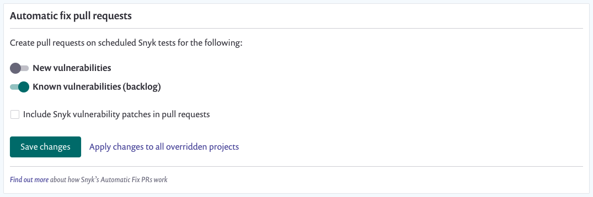

# Fix pull requests for known vulnerabilities \(backlog\)

**Known vulnerabilities** retrieve vulnerabilities from the project's backlog. These are the previously declared vulnerabilities.

The following rules are applied to automatic PR creation for vulnerabilities:

* Pull requests are created based on the **Test & Automated Pull Request Frequency** \(see screenshot below\) setting
* If a scan is manually run \(you clicked **Retest now** for the project\), the 24-hour window is marked as having been run and no automatic PR is created until the next automated scan runs
* One pull request is created per project \(priority score of **700 and above only**\)

To know when your last 24-hour window was kicked off, check the project page for **Snapshot taken by recurring test**--also check your email for **\[snyk\] Vulnerability alert** for specific scan results:

## Enable or disable pull requests for integrations

To enable at the global integration level:

1. Click on settings  &gt; **Integrations**
2. Select an SCM integration \(for example, GitHub\)
3. Enable **Known vulnerabilities \(backlog\)**

**Apply changes to all overridden projects** will update all of the individual project settings for "Automatic fix pull requests". If a project previously had its own settings for this, clicking on this button will override it with the global setting.

### Enable or disable pull requests for a single project

Enabling/disabling at a project level will override this single project rather than inheriting it from the global integration setting.

1. Navigate to the project and select **Settings**
2. Select **GitHub integration**
3. Under the **Automatic fix pull requests** section:
   * Select to **Customize for only this project**
   * Enable **Known vulnerabilities \(backlog\)**

 
  


Ready to get started with Snyk? [Sign up for free!](https://snyk.io/login?cta=sign-up&loc=footer&page=support_docs_page)
