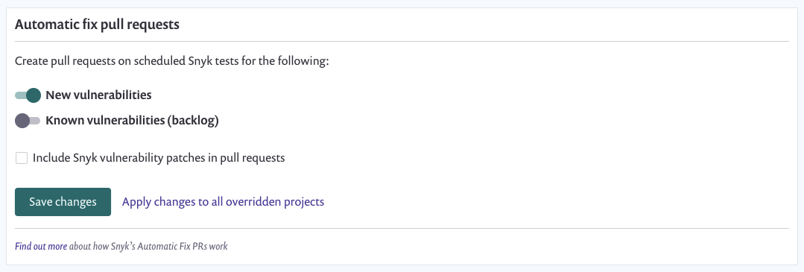

# Fix pull requests for new vulnerabilities

The following rules are applied to automatic PR creation for vulnerabilities:

* Pull requests are created based on the **Test & Automated Pull Request Frequency** \(see screenshot below\) setting
* If a scan is manually run \(you clicked **Retest now** for the project\), the 24-hour window is marked as having been run and no automatic PR is created until the next automated scan runs
* One pull request is created per project \(priority score of 700 and above only\)
* The vulnerability must be new since the last scan and have a fix
* If the vulnerability is known \(backlog\) it will have a PR created when this setting is enabled only when a new fix has been released since the last scan and is considered a **new** vulnerability

To know when your last 24-hour window was kicked off, check the project page for **Snapshot taken by recurring test**--also check your email for **\[snyk\] Vulnerability alert** for specific scan results:

Pull requests for new vulnerabilities are enabled by default for new integrations.

See [Git repository SCM integrations](https://support.snyk.io/hc/en-us/sections/360001138098-Git-repository-SCM-integrations) for full details of supported integrations.

## Enable or disable pull requests for an integration

Enable at the global integration level:

1. Navigate to settings  &gt; **Integrations**. 
2. Select an SCM integration \(for example, GitHub\). 
3. Enable **New vulnerabilities**

**Apply changes to all overridden projects** will update all of the individual project settings for "Automatic fix pull requests". If a project previously had its own settings for this, clicking on this button will override it with the global setting.

## Enable or disable pull requests for a single project

Enabling/disabling at a project level will override this single project rather than inheriting it from the global integration setting.

1. Under **Projects** select a project and select **Settings** \(top right-hand corner\)
2. Select **GitHub integration**
3. Under the **Automatic fix pull requests** section:
   * Select **Customize for only this project**
   * Enable **New vulnerabilities**
   * Select **Save changes**


Ready to get started with Snyk? [Sign up for free!](https://snyk.io/login?cta=sign-up&loc=footer&page=support_docs_page)


