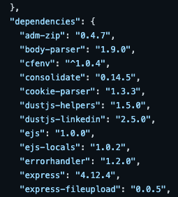

# Integrate Snyk into your workflow

This example shows how Snyk can integrate into your GitHub-based workflow.

## Step 1: Set up environment

1. Open up [Snyk CLI](https://docs.snyk.io/snyk-cli), and run a git clone command on the **goof** repository.

   ```text
      git clone https://github.com/snyk/goof.git
   ```

2. Create a new branch, add vulnerabilities on this branch, then merge changes back to GitHub as a Pull Request:

   ```text
      git branch add_vulns
      git checkout add_vulns
   ```

## Step 2: Add an open source dependency

Review the **package.json** manifest file in your cloned goof application, to see multiple direct dependencies listed:




These direct dependencies can also have additional transitive dependencies; libraries that they depend on.


To add the dependency:

* Add the **tinymce 4.1.0** library at the bottom of the dependencies list:  

```text
   {
   "name": "goof",
   ...
   }
   "dependencies" {
    ...
   "typeorm": "^0.2.24",
   "tinymce": "4.1.0"
   },
   ...
```


Tip: remember to place a comma after the previous dependency.


* Create a [lock file](https://docs.npmjs.com/files/package-lock.json) for our Node application:

  ```text
  npm install --package-lock
  ```


Tip: if this file already exists, run rm package-lock.json to remove it**.**


## Step 3: Commit and review changes

* Commit your change locally, checking the status of the change in our local git repository, then adding the change to our local git, then committing it:  

```text
   git status
   git add package*
   git commit -m "adding tinymce v4.1.0"
```

* Commit your local code change to GitHub, transferring the files and history to your upstream git repository on GitHub:  

```text
   git push --set-upstream origin add_vulns
```

```text
GitHub has received your changes on your **add\_vulns** branch.
```

* In GitHub, click **Compare & pull request** to compare the **add\_vulns** branch with the **master** branch and generate a pull request:


## Step 4: Snyk tests pull request checks

Snyk automatically tests your pull request for vulnerability and license checks in the merge process:


As the PR workflow completed, Snyk validated the vulnerability and license policy set for the project. Based on the policy, the checks either passed or failed; this is shown in GitHub.

This allows you to establish a security gate and prevent pull requests from adding new vulnerabilities, or new open source libraries that do not meet your license policy, to the source code baseline.

For more details on PR checks see the article on our [GitHub integration](../../integrations/git-repository-scm-integrations/github-integration.md).


