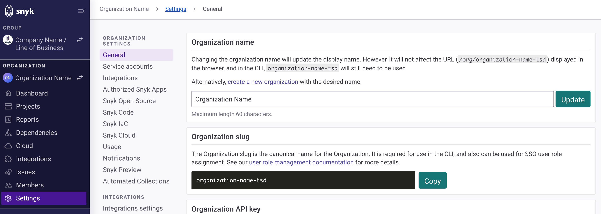

# Group and Organization settings

## Group settings

At the Group level, select **Settings** to manage Group settings:

<figure><figcaption></figcaption></figure>

From the Group settings menu, select **Settings** and then select one of the Group settings options:

* **General**: See [Group general settings](groups/group-general-settings.md) for details.
* **SSO**: See [Self-Serve Single Sign-On (SSO)](../../implementation-and-setup/enterprise-setup/single-sign-on-sso-for-authentication-to-snyk/configure-self-serve-single-sign-on-sso/) for details.
* **Member roles**: See [Manage Member Roles](../user-roles/user-role-management.md) for details.
* **Service accounts**: See [Service accounts](../../implementation-and-setup/enterprise-setup/service-accounts/) for details.
* **Notifications**: See [Manage notifications](../manage-notifications.md) for details.
* **Usage**: See [Usage setting](usage-settings.md)s for details.
* **Your plan and billing**: Billing is through a contract and cannot be changed by using this option. Contact your sales representative or [Snyk support](https://support.snyk.io) if you have billing-related requests or issues.
* **Available plans**: Billing is through a contract and cannot be changed by using this option. Contact your sales representative or [Snyk support](https://support.snyk.io) if you have billing-related requests or issues. For more information, see the [Plans and pricing](https://snyk.io/plans/) page on the Snyk website.
* **Snyk Preview**: Preview upcoming and experimental features before they are released. See the [Snyk Preview](../snyk-preview.md) documentation for details.
* **Snyk IaC**: Enable rules to add checks to Snyk rules when you are scanning configuration files with the Snyk CLI. See the [IaC documentation](../../scan-with-snyk/snyk-iac/) for details.

## Organization settings

At the Organization level, select **Settings** to manage Organization settings:

<figure><figcaption>
Organization settings
</figcaption></figure>

<figure><figcaption></figcaption></figure>

From the Organization setting menu, select **Settings** and then select one of the Organization settings options:

* **General**: See [Organization general settings](organizations/organization-general-settings.md) for details.
* **Service accounts**: See [Service accounts](../../implementation-and-setup/enterprise-setup/service-accounts/) for details.
* **Integrations**: Set up integrations and see a list of those configured for your Organization; click the name of the configured integration to see the details. See [Integrate with Snyk](../../integrations/integrate-with-snyk.md) for information about available Snyk integrations.
* **Snyk Open Source**: Enable Reachable vulnerabilities analysis and edit language settings; see [Snyk Open Source - supported languages and package managers](../../supported-languages/supported-languages-package-managers-and-frameworks.md) for details.
* **Snyk Code**: Enable Snyk Code; see the [Snyk Code](../../scan-with-snyk/snyk-code/) documentation for details.
* **Snyk IaC:** Enable Snyk Iac, detecting configuration files, and rules. Select severity levels for configurations scanned. See the [IaC ](../../scan-with-snyk/snyk-iac/scan-your-iac-source-code/)documentation for details.
* **Usage**: See the [Usage settings](usage-settings.md) page for details.
* **Notifications**: See the [Manage notifications](../manage-notifications.md) page for details.
* **Snyk Preview**: See the [Snyk Preview page](../snyk-preview.md) for details.
