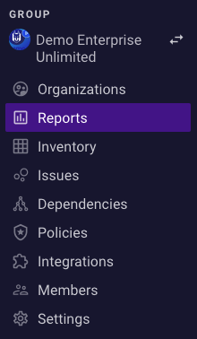
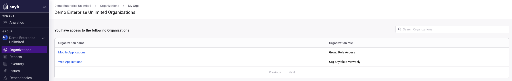
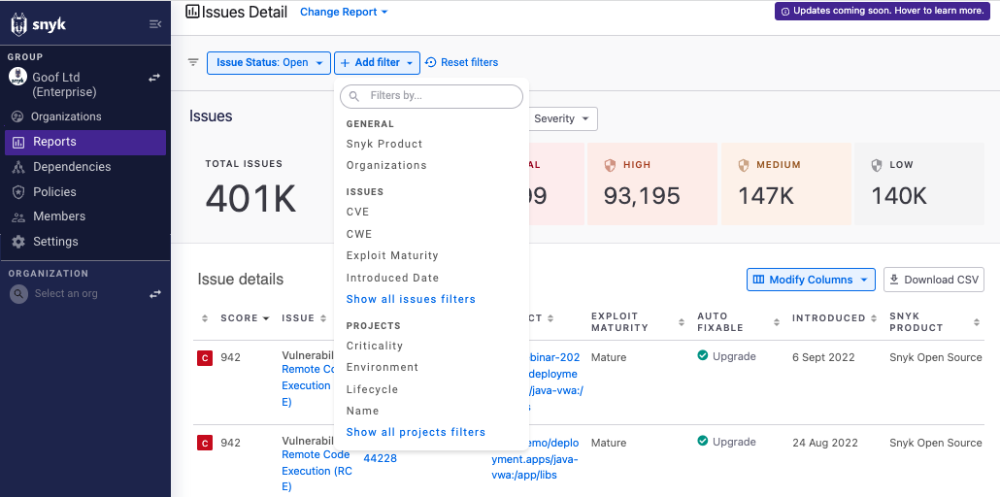
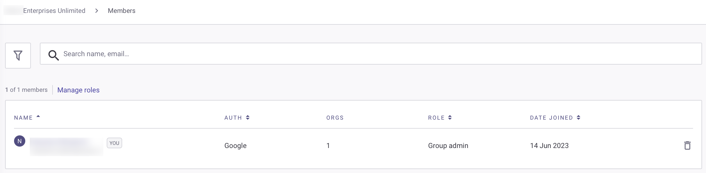

# Groups


**Feature availability**\
This feature is available only with Enterprise Plans. For more information, see [plans and pricing](https://snyk.io/plans/).


Snyk Groups make it easier for you to work in teams. Groups can contain many Organizations, and each Organization can contain many collaborators and Projects.

As part of your onboarding, Snyk sets you up with a Group for your company. You can then add your current Organizations to this Group. If you think your company will need multiple Groups, submit a request to [Snyk Support](https://support.snyk.io). See [Structure your account for high application performance](../../structure-your-account-for-high-application-performance.md) for details concerning multiple Groups.

## Group-level options

Use Group-level options to view [Organizations](./#group-organizations), [reports](./#group-reports), [dependencies](./#group-dependencies), and [policies](./#group-policies) across all of the Organizations in your Group, configure your [Group settings](./#group-settings), and view all the [users](./#group-members) in a Group.

<figure><figcaption>
Group-level options for Enterprise plan users
</figcaption></figure>

### Group Organizations

Select **Organizations** to view all the Organizations you have access to and your assigned role inside each one:

<figure><figcaption>
A list of all the Organizations a user has access to
</figcaption></figure>

If your Group is set up to let its users join Organizations, you also see a list of all the Organizations in the Group and options to join the Organizations where you are not a member.


For a detailed breakdown of user roles and their associated access permissions, see [User roles](../../user-roles/).


### Group reports

Select [**Reports**](../../../manage-risk/reporting/) to view the vulnerability status of the Organizations in your Group in one place as a report:

<figure><figcaption>
Group report filtered to show open issues
</figcaption></figure>

### Group inventory

Select [**Inventory**](../../../manage-assets/manage-assets.md#inventory-menu) to view, filter, and manage your assets.

### Group issues

Select [**Issues**](../../../manage-risk/prioritize-issues-for-fixing/) to better identify and prioritize your Container, Code, and Open Source issues based on the risk they pose to your application. **Issues** offer a centralized view of all the issues identified by Snyk with additional asset context.

### Group dependencies

Select [**Dependencies**](../../../manage-risk/reporting/dependencies-and-licenses/) to view the dependencies and license issues for your Groups:

<figure><figcaption>
View Group dependencies
</figcaption></figure>

### Group Policies

Select [**Policies**](../../../manage-risk/policies/) to view the license and security policies or the assets policies for your Group.

<figure><figcaption>
Policies menu with focus on Assets tab
</figcaption></figure>

### Group integrations

Select **Integrations** to view and configure the available integrations for both [SCM integrations](../../../developer-tools/scm-integrations/group-level-integrations/) and [third-party integrations](../../../integrations/integrate-with-snyk.md).

### Group members

Select **Members** to view users in the Group.

Group members are users who have access to all Organizations in the Group. Users of the Organizations are managed in the Settings of each Organization.

<figure><figcaption>
Members view for Group users
</figcaption></figure>


See [Manage users in a Group](manage-users-in-a-group.md) for details.


### Group Settings

Select **Settings** to view and manage Group settings.

See [Manage settings](../group-and-organization-settings.md) for details.
