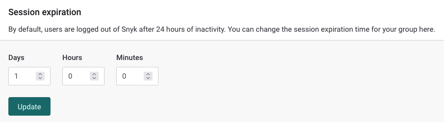

# Configure session length for a Snyk Group

By default, inactive logged-in users are automatically logged out after 24 hours to protect any account from being exposed inadvertently through user inactivity.

Group admins can change the default session length to any value from five minutes to 30 days.


Users who belong to multiple Groups are always logged out automatically after the shortest time configured for any of those Groups.


## **Prerequisites for configuring session length**

You must be an administrator of the Group to update the session length.

You must be a customer on a Snyk plan that supports Groups. For more information, see [Plans and pricing](https://snyk.io/plans/).

## **Steps to configure session length**

1. Log in to your Snyk account and navigate to the Group for which you want to configure session length.
2. Navigate to **Settings** to update the Group settings.
3. In the **Session expiration** area, enter values for the session length:

<figure><figcaption>
Session expiration area of Group settings
</figcaption></figure>

When session length expiration is configured, tracking of session length starts within 60 seconds or when a user logs in, whichever comes first.


See the [Group general settings](group-general-settings.md) documentation for more information about Group settings.

