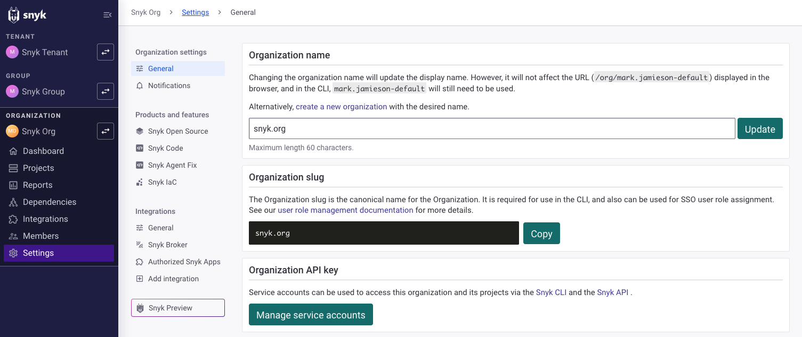

# Organization general settings

To view and modify settings for your Organization, be sure you are in your Organization and navigate to **Settings** > **General**:

<figure><figcaption>
Organization general settings
</figcaption></figure>

In the Organization general settings, you can view and modify the following:

* **Organization name**: Set the display name for this Organization. For example, you may want to change the default initial Organization display name to reflect better the work that Organization relates to. Note that changing the Organization display name does not change the URL displayed in the browser bar or the internal name used by the CLI. To fully change the name, [create a new Organization](https://app.snyk.io/create-organisation) with the desired name.
* **Organization API key:** View or copy the Organization API key. [Service accounts](../../../implementation-and-setup/enterprise-setup/service-accounts/) require an API key (token) to substitute for standard user credentials. Click the **Manage Service accounts** button to set up details for service accounts.
* **Organization ID**: View or copy the Organization ID, which is the internal ID for the Organization, generated automatically when each Organization is created. This ID uniquely identifies this Organization and is required when you use the  [Snyk API](../../../snyk-api/snyk-api.md). These Organization identification details are generated automatically by Snyk for each Organization when it is created.&#x20;
* **Ignores**: Define Organization-wide ignore settings. You can choose from the following options:
  * **Ability to ignore an issue, or edit the ignore settings on an issue** **through the Snyk app or API**
    * `Admin users only`
    * `All users in any environment`
  * **Ability to ignore issues through the CLI or `.snyk` file**
    * `Snyk app and API only`
    * `Snyk app, API, CLI and .snyk file in repository`
  * **Require reason for each ignore**
    * `Required (only applies to ignores in the Snyk app, not the CLI or API)`
    * `Not required`
    * See [Configure Ignore settings](../../../manage-risk/prioritize-issues-for-fixing/ignore-issues/#configure-ignore-settings) in the Ignore issues documentation for more details.
* **Requesting access**: Enable to allow users without access to this Snyk Organization to request access. This includes external users. For more details, see [Enable the request for access setting](requests-for-access-to-an-organization.md#enable-the-request-access-setting) in the documentation of requests for access to an Organization.
* **Leave Organization**: Leave this Organization. You will lose access to the Projects and notifications for that Organization.
* **Delete Organization**: Delete this Organization to remove it entirely from Snyk, including all of its Projects and their historical data. See [Delete an Organization](create-and-delete-organizations.md#delete-an-organization) in the Manage Organizations documentation for details.

For more information about Organization settings, see [Manage Organizations](create-and-delete-organizations.md).
