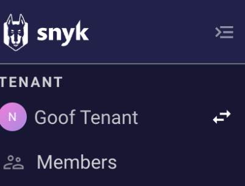

# Manage users in a Tenant


**Feature availability**

Tenant functions are available only with Enterprise plans. For more information, see [plans and pricing](https://snyk.io/plans/).


Select the name of your Tenant and the **Members** menu option to manage members:

<figure><figcaption>
Members page option in the Tenant menu
</figcaption></figure>

## View Tenant members

<figure><figcaption>
Tenant member management list with assigned roles
</figcaption></figure>

On the Tenant **Members** page, you can see all the users associated with your Tenant, their authentication type, and their Tenant role. The [pre-defined](../../user-roles/pre-defined-roles.md#role-types) Tenant roles are:

* **Tenant Admin**: can access all Tenant products and settings. Reserved for Snyk Admins only.
* **Tenant Viewer:** can see the list of all Tenant users, all the Groups, and all the Organizations of the Tenant.
* **Tenant Member**: the default role of all users of the Tenant with no access to any Tenant level option.

Users with the Tenant Admin or Tenant Viewer roles can navigate the list of users by:

* Reading through the pages of users
* Searching by full name
* Filtering the list by role

## Change Tenant roles


Only Tenant Admins can change the roles of Tenant users.


You can promote a Tenant Member to a Tenant Viewer or Admin by selecting the role dropdown next to the user's name and choosing the appropriate option.

## Delete Tenant Members


Only Tenant Admins can delete Tenant users.


To delete a member from the Tenant, click the trash icon next to the user.
