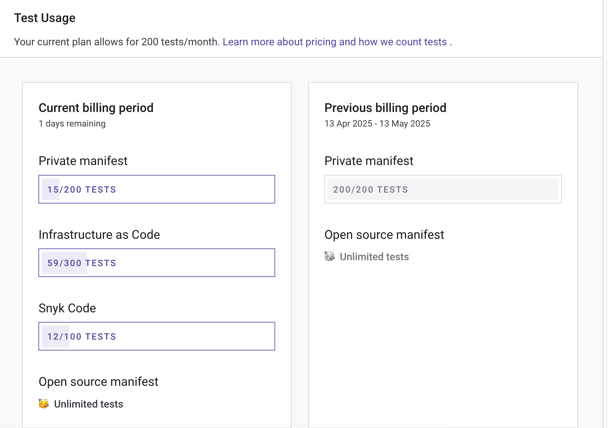
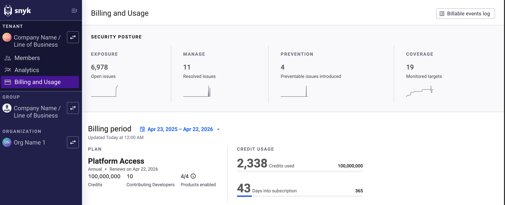
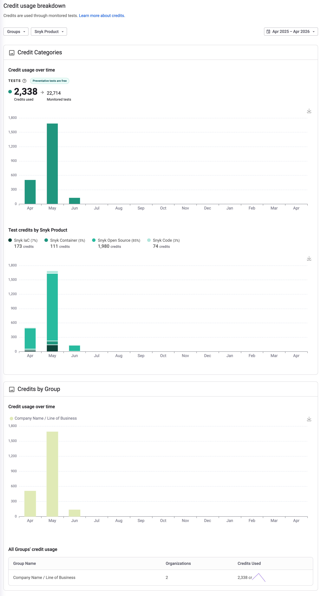

# Usage settings

In your Group or Organization, select **Settings** > **Usage** to view Snyk usage details for your Group or Organization:

* **Test usage**: the number of tests used
* **Contributing developers**: the number of developers contributing to Projects


For more information about test frequency settings, see [Project actions](../snyk-projects/#project-actions-on-the-project-listing-page) on the Project Listings page, where bulk actions are also explained.


## Test usage

The **Test Usage** section shows how many tests you are using over the current billing period:

<figure><figcaption>
Test usage data
</figcaption></figure>


Test limits vary for Snyk products and plans.

For the Free plan, the limits are: Open Source, 400 tests; Code, 100 tests; IaC, 300 tests; Container, 100 tests.

See the [Plans and pricing page](https://snyk.io/plans/) for more details. See [What counts as a test?](../../snyk-data-and-governance/what-counts-as-a-test.md) for details of how Snyk counts tests.


## Contributing developers

Snyk defines contributing developers as developers having made a commit to a private repo monitored by Snyk in the last 90 days.

The **Contributing developers for SCM and CLI integrations** section shows contributing developer counts, both at the Organization level and the Group level.

The developer count is the number of developers who have contributed to the default branch of any private repository connected to an integration.

Snyk does not count contributions to public (open-source) repos because the pricing model is based on the number of contributing developers to private repositories.

The contributing developers count shows:

* **Total unique contributors across all integrations:** the number of contributors across all the integrations in your Snyk account. Contributing developers are only counted once, even if they have contributed to multiple integrations or multiple repositories.
* **Breakdown by integration**: the number of contributors, Organizations, and repos in that integration.

A contributor is recognized through the author email field, set in the local Git settings.

## Billing and Usage


The Billing and Usage menu is available only to Tenant Admins on the Snyk Credits plan and the Snyk Platform Access plan (excluding new customer enrollments).

For more information on billable events and credits for the Snyk Credits plan, visit [Policies](https://snyk.io/policies/credit-based-billing/).\
For more information on billable events and credits for the Snyk Platform Access plan, visit [Policies](https://snyk.io/policies/definition-of-snyk-platform-access/).


At the Tenant level, navigate to **Billing and Usage** to view credit consumption and usage patterns across all Groups and Organizations within the selected Tenant. The **Billing and Usage** dashboard also provides an overview of which Snyk products and Projects consume your credits.

<figure><figcaption>
Billing and Usage dashboard
</figcaption></figure>

The **Billing and Usage** dashboard provides the following information:

* **Billing period**
* **Platform Access:** the number of available credits per billing period, the number of contributing developers, and the Snyk products enabled. To see which Snyk products are enabled, hover over the information button.


You may need to enable certain capabilities at the tenant level to begin using Snyk. Capability enablement can be done in the Snyk Console through your tenant’s **Settings** page in the navigation panel.


* **Credit usage:** the number of credits used so far and the number of days left on your subscription.
* **Billable events log:** a detailed list of all billable events.

You can also see a breakdown of your credit usage and filter the information by Group, Snyk product, or date range.

<figure><figcaption>
Example of credit usage breakdown
</figcaption></figure>
