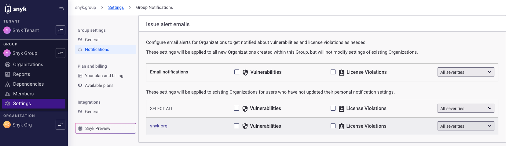
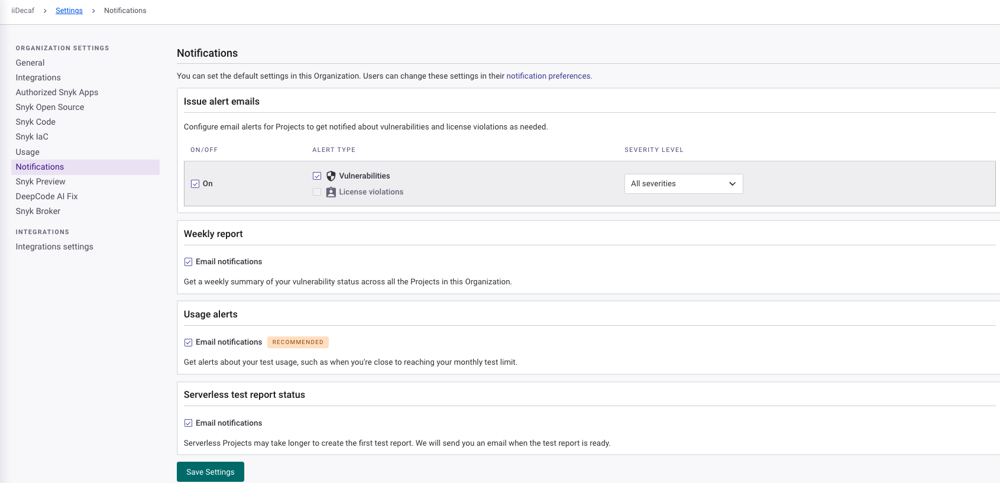
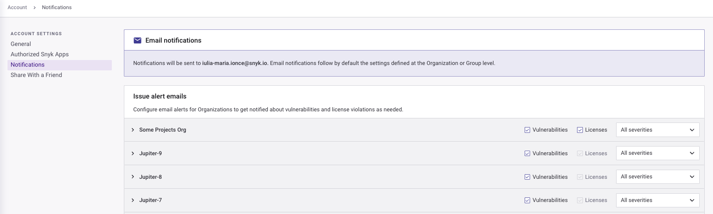

# Manage notifications

Snyk notifies you automatically when new issues are found in the Projects you are monitoring to alert you to new possible new risks in these Projects.

## How notifications are sent

Snyk can send notifications in the following ways:

* By email, if you have configured [email notifications in your account settings](https://app.snyk.io/account/notifications).
* By Slack, if you have set up [Slack integration](../integrations/jira-and-slack-integrations/slack-integration.md).

Snyk also sends you a weekly update summarizing the security status across all of your Organizations.

Snyk offers notifications for:

* vulnerabilities
* license issues
* weekly summary report
* usage alerts
* report status


Setting a Project to inactive does not stop Snyk from sending notifications. You must disable notifications separately for that Project.



**FedRAMP environment notifications**\
Both [issue alert emails](manage-notifications.md#group-defaults-for-issue-alert-emails) and [weekly report emails](manage-notifications.md#group-defaults-for-weekly-report-emails) are disabled for FedRAMP environments. Their notification settings may be hidden from the page.


## How to manage notifications

Snyk provides controls to manage your own notifications. Administrators can manage the notification defaults for others in the [Group](manage-notifications.md#define-group-notification-defaults) or [Organization](manage-notifications.md#define-organization-notification-defaults).


Weekly notification emails are sent only to Organization users, so Group Admins must add themselves as an Organization member for Organizations where they need to receive the emails.


You can also send notifications for an Organization to a designated Slack channel. For details, see  [Slack integration](../integrations/jira-and-slack-integrations/slack-integration.md).

### Define Group notification defaults

Define the notification settings at the Group level to define the template for how Snyk sends issue alert emails, weekly report emails, usage alert emails, and report status emails for Organizations created in that Group. You also have access to the default settings for existing individual Organizations at the Group level.


Changing the Group default settings does not change the settings for existing Organizations or Projects. Individual users can override the default notification settings.


To navigate to the Group level notification settings:

1. Navigate to the Group overview for the Group you want to change.
2. Select **Settings**.
3. Select **Notifications**.

<figure><figcaption>
Notification settings at the Group level
</figcaption></figure>

#### Group defaults for issue alert emails

Issue alert emails are notifications Snyk sends the same day as it finds a new vulnerability, license issue, or remediation.

To set the defaults for issue alert emails:

1. Check the **Vulnerabilities** box when users of new Organizations in this Group should receive alert emails by default for new issues or remediations for all Projects in a new Organization.
2. Check the **License Violations** box when users of new Organizations in this Group should receive alert emails for new license issues or remediations for all Projects in a new Organization.
3. If either the **Vulnerabilities** or **License Violations** boxes are checked, indicate the severity of issues for which Snyk should send alert emails by selecting **All severities** or **Critical and high severity** from the drop-down list.
4. To change the default for individual organizations, change the **Vulnerabilities**, **License Violations,** and **Severity** settings next to the Organization name. These settings apply for any individual user who has not updated personal notifications when you create new Organizations in this Group.

#### Group defaults for weekly report emails

Weekly report emails are notifications Snyk sends to provide a summary of the vulnerability status across all Projects and Organizations to which a user belongs. For an Organization with zero vulnerabilities across its Projects, the notification lists the number of active Projects, the number of known vulnerabilities, and total dependencies.

To set the defaults for weekly report emails:

* Check the **Email notifications** box when users of new Organizations in this Group should receive a weekly summary email.
* To change the defaults for individual Organizations, clear or check the box next to the Organization name. The defaults will apply for new Organizations created in this Group.


Individual Projects cannot be excluded from Weekly reports. They can be excluded only from Issue Alert emails, and new vulnerabilities or remediations.&#x20;


#### Group defaults for usage alerts

Usage alert emails are notifications Snyk sends to warn you when you are approaching usage limits.

To set the defaults for usage alerts:

* Check the **Email notifications** box when users of new Organizations in this Group should receive usage alert emails.
* To change the defaults for individual Organizations, clear or check the box next to the Organization name. The defaults will apply for new Organizations created in this Group.

### Define Organization notification defaults

Define the notification settings for the Organization to determine how Snyk sends emails to all individuals in the Organization who have not changed their personal notification preferences.


Changing the Organization default settings does not change the settings for existing Projects or individual users. Individual users can override the default notification settings.


To navigate to the Organization-level notification settings:

1. Navigate to the Organization you want to change.
2. Select **Settings**.
3. Select **Notifications**.

<figure><figcaption>
Notification settings at the Organization level
</figcaption></figure>

#### Organization defaults for issue alert emails

Issue alert emails are notifications Snyk sends the day it finds a new vulnerability, license issue, or remediation.

To set the defaults for issue alert emails:

* Clear the **On** box to turn off issue alert emails for new Projects imported into this Organization. Check the box when new Projects in this Organization should receive the defined alerts.
* Check the **Vulnerabilities** box to set the default for all Projects in this Organization to generate alert emails for new issues or remediations.
* Check the **License violations** box to set the default for all Projects in this Organization to generate alert emails for new license issues or remediations.
* If either the **Vulnerabilities** or **License violations** boxes are checked, indicate the severity of issues for which Snyk should send alert emails by selecting **All severities** or **Critical and high severity** from the drop-down Projects list.

#### Organization defaults for weekly report emails

Weekly report emails are notifications Snyk sends to provide a summary of the vulnerability status across all Projects and Organizations to which a user belongs.

To set the defaults for weekly report emails, check the **Email notifications** box under **Weekly report** when members of this Organization should receive a weekly summary email by default.

#### Organization defaults for usage alerts

Usage alert emails are notifications Snyk sends to warn you when you are approaching usage limits.

To set the defaults for usage alerts, check the **Approaching test limit** box when members of this Organization should receive usage alert emails by default.

## Change personal notification preferences

Organizations to which you belong have default settings for how Snyk sends emails.

To override these settings, change your notification preferences:

1. Select the dropdown next to your name.
2. Select **Notification preferences**.

<figure><figcaption>
Notification settings at the Account level
</figcaption></figure>

The Account Settings page allows you to change the types of notifications for each Organization to which you belong. You can also customize the notifications for individual Projects.

### Preferences for issue alert emails

Issue alert emails are notifications Snyk sends the day it finds a new vulnerability license issue, or remediation.

To customize your settings for issue alert emails for each Organization for which you are a member:

* Check the **Vulnerabilities** box to receive alert emails for new issues or remediations for all Projects in the Organization.
* Check the **Licenses** box for Open Source to receive alert emails for new license issues for all Projects in the Organization.
* If either the **Vulnerabilities** or **Licenses** boxes are checked, indicate the severity of issues for which Snyk should send alert emails by selecting **All severities** or **Critical and high severity** from the drop-down list.

To customize your settings for individual Projects:

1. Expand the Organization to see a list of Projects in the Organization.
2. Next to each Project name, clear or check the **Vulnerabilities** or **Licenses** boxes and set the severity for the Project.

### Preferences for weekly report emails

Weekly report emails are notifications Snyk sends to provide a summary of the vulnerability status for the Projects in the Organizations to which you belong.

To include Organizations in your weekly report emails, check the box next to each Organization for which you want to receive alerts.

### Preferences for usage alerts

Usage alert emails are notifications Snyk sends to warn you when you are approaching usage limits.

To receive usage alerts for an Organization, check the box next to the Organization.
