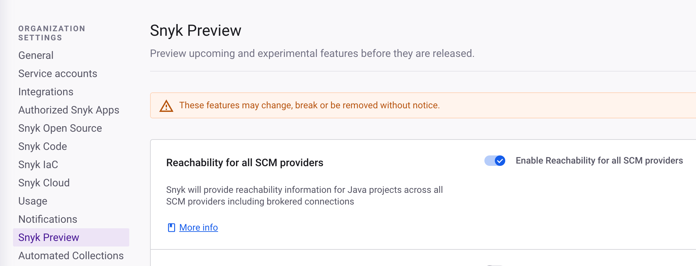

# Snyk Preview


[Snyk IDE plugins](../developer-tools/snyk-ide-plugins-and-extensions/) also have preview features. These preview features are separate from Snyk Preview and can be found in the documentation for the IDE-specific plugin.


Snyk Preview lets you enable new features that may not be available to all customers by default.

Users with Admin permissions can use Snyk Preview at the Organization and Group levels.

To enable a feature using Snyk Preview:

1. At either the Group or Organization level, select **Settings** > **Snyk Preview.**
2. Select **Enable feature preview** to enable or disable a feature.
3. Click **Save changes**.

<figure><figcaption>
Snyk Preview
</figcaption></figure>


After the feature is enabled at the Group level, all Organizations in the Group have this feature, and it cannot be disabled individually for these Organizations.

Additionally, some features can only be made available at the Group level - these are indicated appropriately.

