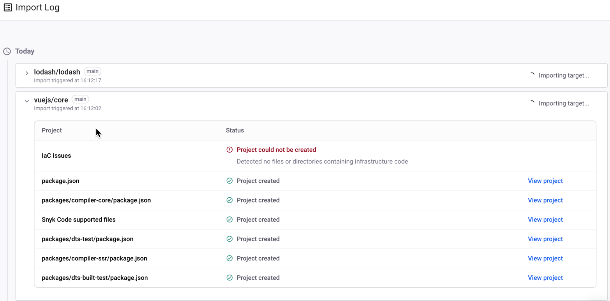
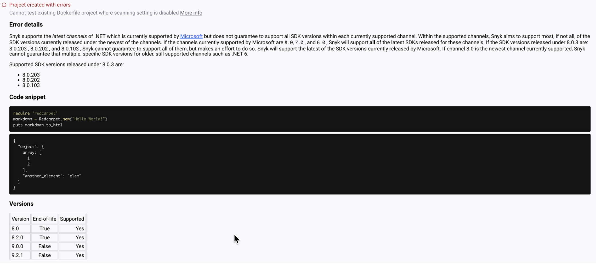

# Import log

The Import log feature provides a history of all the Git repositories and container registry images imported into an Organization through an Integration, allowing all manual and automated changes to be reviewed and any errors troubleshooted. This log makes it easier to see if any errors have occurred and how to resolve them.

## View import log

The Import Log is located under the Organization **Projects** page in the Snyk Web UI.\
Select the **View import log** button next to **Add Projects**.


You must have the View Organization and View Project [permissions](../user-roles/pre-defined-roles.md) to view Import Log messages for imports made within your Organization.


## Import log timeline

The Import Log timeline will go back as far as the **most recent** applicable condition of:

* January 25th 2023.
* The date the Organization was created.

For example, if the Organization was created before January 25th, 2023, Snyk cannot retrieve any logs before that date.

<figure><figcaption>
The Import Log timeline
</figcaption></figure>

The Import Log shows all imported targets listed in reverse chronological order, with the most recent import at the top of the page. Each import can be expanded using the dropdown, listing all the imported Projects created in Snyk at the time of import.

Targets that are in the process of being imported will have a loading icon stating **Importing target**.

Selecting **View Project** will take you to the Issues tab for that specific Project.

## Import log error messages

If an error occurs on import, a warning icon will display on the repository name. Expanding this will show the Project the error is related to, with the error detail under the **Status** column.

The error messages that can be displayed are:

* Project created with errors.
* Project could not be created.
* Project failed to import.

<figure><figcaption>
A detailed error message for Project created with errors
</figcaption></figure>


Snyk displays detailed error messages for `golang-deps`, `npm-deps`, `dotnet-deps`, `maven-deps` and `pip-deps` ecosystems.

