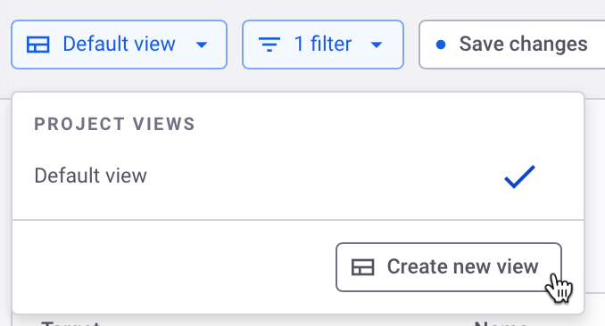
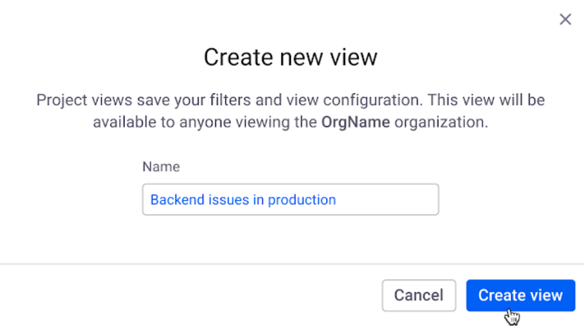
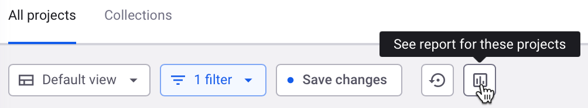

# Project views

On this page you will find information about how to create and use Project views:

* [Create and configure a Project view](project-views.md#create-and-configure-a-project-view)
* [View reports on your Projects](project-views.md#view-reports-on-your-projects)


A Project view is visible to all users in the same Organization they were created in.


## Create and configure a Project view

1. On the right side of the Project listing page, beneath the **View import log** button, select **Group by none** from the drop-down list.
2. Click the drop-down next to the FILTERS drop-down, and click **Create new view**. If you already have filters selected, click **Save changes** next to the drop-down and follow the next step.

<figure><figcaption>
Create a Project view
</figcaption></figure>

3. Enter a name for your Project view in the available field, then click **Create view**.

<figure><figcaption>
Name your Project view
</figcaption></figure>

Your new view is created and automatically selected. Click the icon next to your Project view to duplicate, rename, or delete it.

4. In the filters drop-down, select the criteria to organize your view.

<figure><figcaption>
Apply filters
</figcaption></figure>

5. After applying all the filters you want, click **Save changes** next to the drop-down. Your Project view will be updated.
6. If you want to configure a Project view, select different filters and click **Save changes** again. You can also discard any changes to a Project view before you save them to return it to its most recent saved state.

## View reports on your Projects

1. From the Project view drop-down, select the Project view for which you would like to view the report.
2. Next to the FILTERS drop-down, click **See report for these projects**.

<figure><figcaption>
View report on your Project view
</figcaption></figure>

The Reports page loads and displays a report of the Projects in your Project view based on the filters you selected.

<figure><figcaption>
Automatically scoped report for your Project view
</figcaption></figure>


The scan results you see on the Project listing page will be reflected in the reporting page roughly one (1) hour after the scan is complete.

