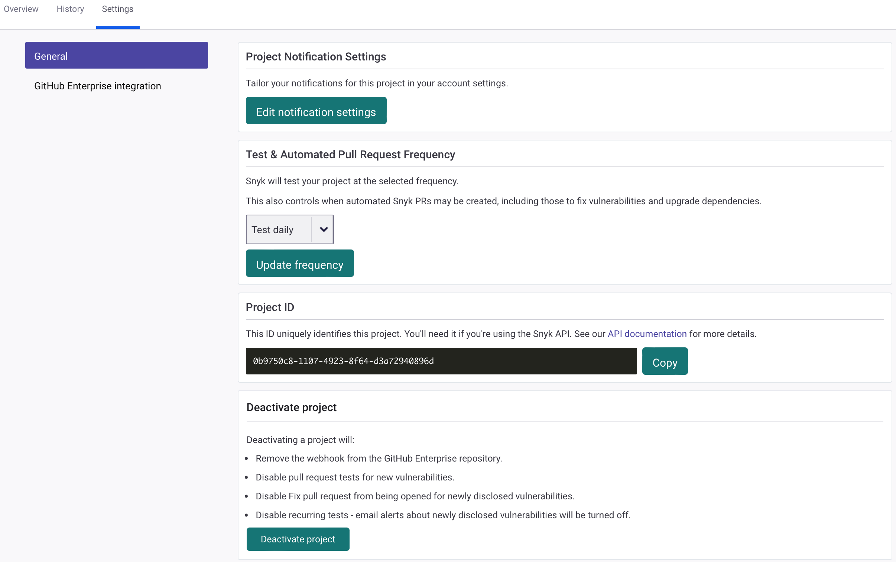

# View and edit Project settings

Select the **Settings** tab on the Project listing or details page to view and edit Project settings:

<figure><figcaption>
Project settings
</figcaption></figure>

Click **GitHub integration** to edit SCM-specific settings. This also applies to other SCMs.

You can edit the **Project Notification Settings** and update the **Test & Automated Pull Request Frequency**. You can also retrieve the **Project ID** for use in Snyk API calls.


The default test frequency and available test frequencies vary depending on the type of Project: Open Source, Code analysis, Container, or IaC. For more information, see [Test frequency settings](./#test-frequency-settings) on the Snyk Projects page. You can also set test frequency by using the API endpoint [Updates project by project ID](../../snyk-api/reference/projects.md#orgs-org_id-projects-project_id).


To deactivate a Project, select **Deactivate project** on the Project settings page. By deactivating a Project, you do the following:

* Remove the webhook from the SCM repository.
* Disable pull request tests for new vulnerabilities.
* Disable a Fix pull request from being opened for newly disclosed vulnerabilities.
* Disable recurring tests; email alerts about newly disclosed vulnerabilities will be turned off.
* Remove any vulnerabilities in the Project from reporting and dashboard views

To delete a Project, select **Delete project** on the Project settings page. By deleting a Project, you do the following:

* Delete the Project and all historical snapshot data from Snyk.
* Remove the webhook from the SCM repository.
