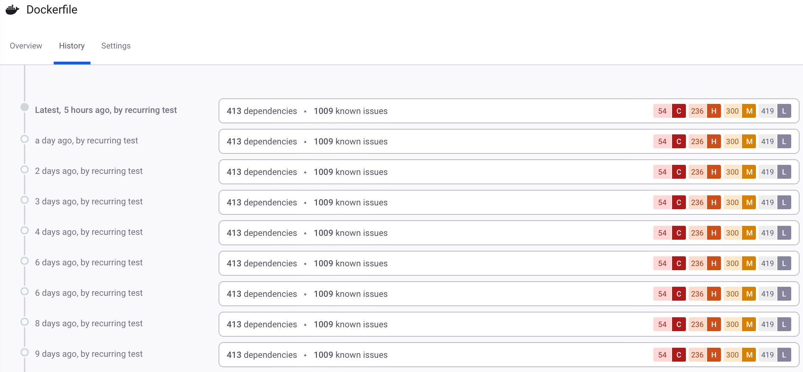

# View Project history

Select the **History** tab on the Project details page to view the Project history, which shows results of previous scans. Under normal circumstances, Snyk retains at least two snapshots: a historic snapshot and a current snapshot of the latest scan. More entries may be shown when the found issues between scans have not changed, but the entries in the list point to the same snapshot. If numerous scans are executed within 24 hours, all of the scans are displayed, distinct issues or not, after which they are purged from the list.

<figure><figcaption>
Project details page History tab
</figcaption></figure>

Click on an entry to view a snapshot of the Project details page for that period.
