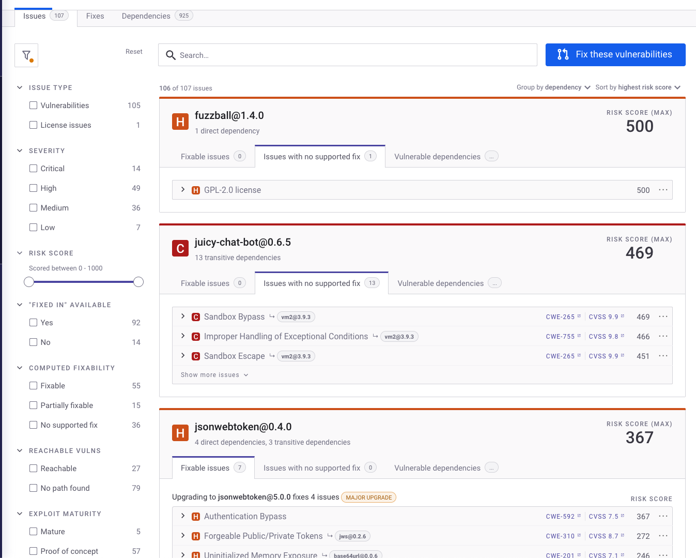
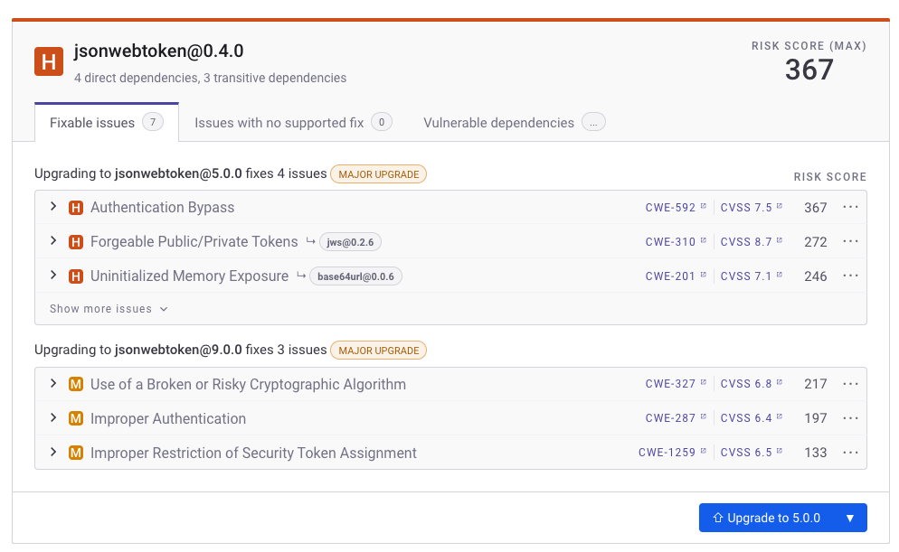
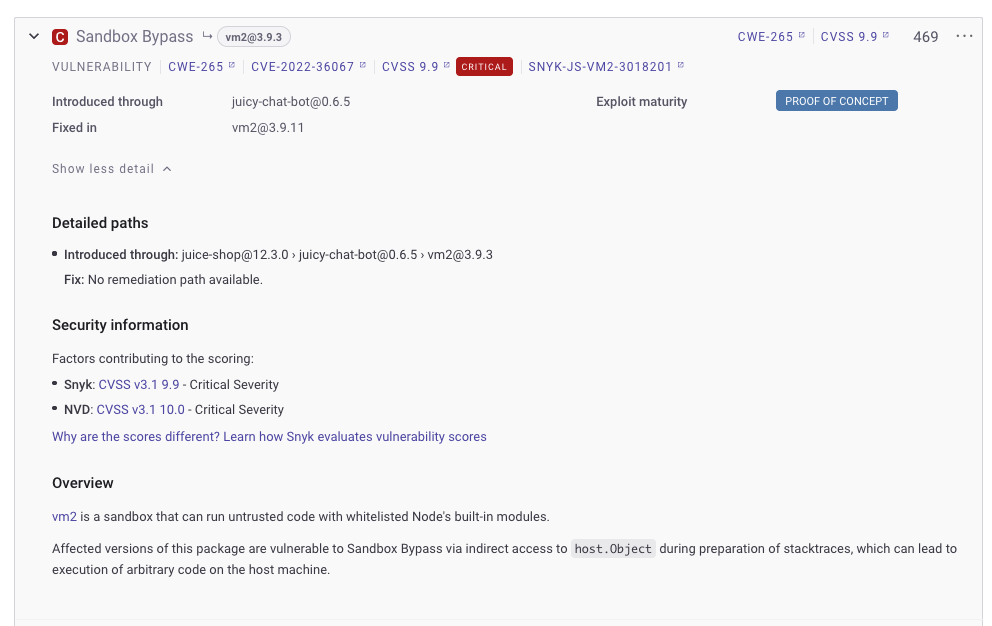

# View Project issues, fixes, and dependencies

The following Project information is available on the Snyk Web UI:

* [Issues](view-project-issues-fixes-and-dependencies.md#view-issues): the number of vulnerabilities and Open Source license issues
* [Fixes](view-project-issues-fixes-and-dependencies.md#view-fixes): fix advice
* [Dependencies](view-project-issues-fixes-and-dependencies.md#view-dependencies): for Open Source, the total number of direct and transitive (nested) dependencies

## View issues

The Project details page displays Issue cards on the **Issues** tab. The information provided includes vulnerabilities and Open Source license issues.

<figure><figcaption>
Project details Issues tab and filters in environments with Fix advice available
</figcaption></figure>

Use the filters in the panel to the left to narrow the search for issues. Select the checkboxes to filter issues by **Issue type**, **Severity**, **Fixability**, **Exploit Maturity**, and **Status**. You can also edit the **Priority Score** slider to change the range displayed; the default is 0 to 1000.

Issue details are shown on issue cards in the main area, sorted by priority score. See [Issue card information](issue-card-information.md) for more details.


Snyk provides features to fix issues identified during scanning. See [Fix your vulnerabilities](../../scan-with-snyk/snyk-open-source/manage-vulnerabilities/fix-your-vulnerabilities.md) for more details.


## View dependency details

Scroll to a dependency and the listed issues to view details, including the max and individual [risk scores](../../manage-risk/prioritize-issues-for-fixing/risk-score.md) (or [priority score](../../manage-risk/prioritize-issues-for-fixing/priority-score.md)).

The Severity icon in front of the dependency title shows the maximum severity associated with the dependency. In this example, there are listed issues with medium or high severity, so the maximum severity for the dependency is high.

The score associated with the dependency title is the maximum of all listed issues under that dependency. This will show as either [Risk Score](../../manage-risk/prioritize-issues-for-fixing/risk-score.md) if you are opted-in to the Early Access feature, or [Priority Score](../../manage-risk/prioritize-issues-for-fixing/priority-score.md).

<figure><figcaption>
View dependency details
</figcaption></figure>

* Click **Learn about this type of vulnerability** for [Snyk Learn](../../discover-snyk/snyk-learn/) training.
* Click **Show more detail** to view detailed information about the vulnerability from the [Snyk Vulnerability database](https://snyk.io/product/vulnerability-database/):

<figure><figcaption>
More information from the Snyk Vulnerability Database
</figcaption></figure>

## View fixes

Snyk knowledge of the transitive dependencies in your Project makes it possible for Snyk to provide additional fix advice on the **Fixes** tab:

<figure><figcaption>
Project details Fixes tab
</figcaption></figure>

See [Fix your vulnerabilities](../../scan-with-snyk/snyk-open-source/manage-vulnerabilities/fix-your-vulnerabilities.md) for details.

## View dependencies in Snyk Open Source

Snyk uses the package manager for your application to build the dependency tree and display it in the **Dependencies** tab of the Project issues detail page for Open Source. This tab shows which components introduce a vulnerability, indicating how the dependency was introduced to the application.

An example follows:

<figure><figcaption>
Issues detail page dependencies tab
</figcaption></figure>

