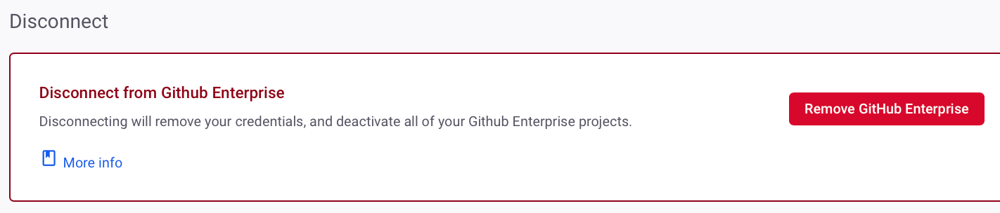

# Snyk GitHub Enterprise integration


If you are a Snyk Enterprise plan customer, Snyk recommends that you use the GitHub Enterprise integration. If you use the self-hosted GitHub Enterprise product, you must use the Snyk GitHub Enterprise integration. See [Using GitHub or GitHub Enterprise integration](introduction-to-git-repository-integrations/using-github-or-github-enterprise-integration.md) for details.



**Feature availability**\
GitHub Enterprise integration is available to Snyk Enterprise plan customers. If you have a Legacy Business plan, contact [Snyk support](https://support.snyk.io/hc/en-us) for access. See the [Plans and pricing](https://snyk.io/plans/) page for details.


## Prerequisites for Snyk GitHub Enterprise integration

* Internet-accessible repositories.\
  If your repositories are not internet-accessible, you must use [Snyk Broker](../../enterprise-configuration/snyk-broker/). This requires creating a startup script. For the script and instructions, see [GitHub Enterprise - install and configure using Docker](../../enterprise-configuration/snyk-broker/install-and-configure-snyk-broker/github-enterprise-prerequisites-and-steps-to-install-and-configure-broker/setup-broker-with-github-enterprise.md).
* A public or private GitHub project.


You do not need to be on a GitHub Enterprise level plan to use the Snyk GitHub Enterprise integration.


## Snyk GitHub Enterprise integration features

The Snyk GitHub Enterprise integration lets you:

* Perform [periodic security scans](snyk-github-enterprise-integration.md#obtain-project-level-security-reports) across all integrated repositories.
* [Detect vulnerabilities](snyk-github-enterprise-integration.md#monitor-projects-and-generate-automatic-fix-pull-requests) in your Open Source components.
* Provide [automated fixes](snyk-github-enterprise-integration.md#test-new-pull-requests) and upgrades through status checks in GitHub.

## How to set up the Snyk GitHub Enterprise integration

Follow these steps to connect Snyk with your GitHub repositories:

1. Create a dedicated service account in GitHub Enterprise with a write level or higher scope for the repos you want to monitor with Snyk permissions.\
   See [Types of GitHub accounts](https://docs.github.com/en/get-started/learning-about-github/types-of-github-accounts) and [Required access scopes for the GitHub integration ](snyk-github-enterprise-integration.md#required-access-scopes-for-snyk-github-enterprise-integration)for details.\
   Note that to create webhooks, which is required for PR checks, the repo permission for the account must be `Admin`. GitHub custom roles are not supported.&#x20;
2. [Generate a personal access token](snyk-github-enterprise-integration.md#how-to-generate-a-personal-access-token) for that account.
3. [Authorize your personal access token and enable SSO.](snyk-github-enterprise-integration.md#how-to-authorize-your-personal-access-token-and-enable-sso)
4. [Import your GitHub repositories](snyk-github-enterprise-integration.md#how-to-import-github-repositories).

### How to generate a Personal Access Token

Generate a classic personal access token for the account with the following access scopes:

* `repo (all)`
* `admin:read: org`
* `admin:repo_hooks (read & write)`

If you are using fine-grained personal access tokens, the following repository access scopes are required:

* `Administration: Read-only`
* `Commit Status: Read and write`
* `Content: Read and write`
* `Metadata: Read-only`
* `Pull requests: Read and write`
* `Webhooks: Read and write`

For fine-grained personal access tokens, an additional `Members access: Read-only` organization access scope is required.


Create a personal access token in GitHub Enterprise under **User settings** > **Developer settings**.



The Snyk GitHub integration is bound to a single user, preferably a GitHub service account. The level of access for the integration is defined by the combination of the user's permissions in GitHub (see [required access scopes](snyk-github-enterprise-integration.md#required-access-scopes-for-snyk-github-enterprise-integration)) and the access defined for the PAT on that user's account. If the PAT is defined with more permission than the user's GitHub account, the integration will not be able to use that permission.



**Why does Snyk require fine-grained access tokens to have `pull request: read/write` and `content: read/write` scopes? Does this mean Snyk can write code to our repos?**

Snyk uses PRs to tell GitHub Enterprise that a merge is to occur. To do this, change content is pushed into a branch, which requires the `content: write` scope. A separate call is then made to create the fix PR, which requires the `pull request: write` scope. GitHub Enterprise is then instructed to create a PR, merging the change branch into the default branch.


### **How to authorize** your Personal Access Token and enable SSO

1. In Snyk, navigate to the **Integrations** page and click the **GitHub Enterprise** card.
2. Enter your GitHub Enterprise URL and the personal access token (PAT) for the service account you created, and **Save** your changes. After Snyk has successfully connected to the GitHub instance, the list of available repositories displays for your selection.
3. If your GitHub Enterprise organization enforces SAML/SSO, select **Configure SSO** next to the PAT in GitHub after the PAT has been created.\
   Occasionally, SSO is enforced in your GitHub Enterprise organizations after a PAT and Integration are configured. If this happens, any Projects that have already been imported show in Snyk, but retests, PR Checks, and so on, will not be performed. To fix this, check the **Configure SSO** settings to ensure the GitHub Enterprise organization is **Authorized**.\
   If the organization is showing as **Authorized**, but the issue still persists, try de-authorizing the organization and then re-authorizing.


To use the integration with GitHub Enterprise Cloud, add the URL `https://api.github.com`. To integrate with a self-hosted GitHub Enterprise, add the URL `https://your.github-enterprise.host` in step two of PAT authorization.

Ensure that there are no trailing characters such as `/` following the url. An integration with trailing characters in the URL may connect successfully but provide incorrect links back to the GitHub files.



If the PAT token changes or expires in GitHub, the integration with Snyk will not function. To resolve this, update the token in the Snyk **GitHub Enterprise Integration settings.**


### How to import GitHub repositories

Select the repositories you want to import to Snyk and click **Add selected repositories**.

Snyk starts scanning the selected repositories for dependency files, such as `package.json`, in the entire directory tree and imports the repositories to Snyk as Projects.

The imported Projects appear on your **Projects** page and are continuously checked for vulnerabilities.

<figure><figcaption>
Importing selected repositories to Snyk
</figcaption></figure>

## Uses of the Snyk GitHub Enterprise integration

### **Obtain Project-level security reports**

Snyk produces advanced security reports, allowing you to explore the vulnerabilities found in your repositories and fix them by opening a fix pull request directly to your repository with the required upgrades or patches.

The example that follows shows a Project-level security report.

<figure><figcaption>
Project-level security report
</figcaption></figure>

### **Monitor Projects and generate automatic fix pull requests**

Snyk scans your Projects on either a daily or a weekly basis. When new vulnerabilities are found, Snyk notifies you by email and opens an automated pull request with fixes for your repositories.

The example that follows shows a fix pull request opened by Snyk.

<figure><figcaption>
Fix pull request created by Snyk
</figcaption></figure>

To review and update the automatic fix pull request settings:

1. In Snyk, navigate to **Settings** > **Integrations** > **Source control** > **GitHub Enterprise** > **Edit Settings**.
2. Scroll to the **Automatic fix pull requests** section, then select options as required:

<figure><figcaption>
Automatic pull request settings
</figcaption></figure>

### **Test new pull requests**

The [PR Checks](../../scan-with-snyk/pull-requests/pull-request-checks/) feature enables Snyk to test any newly-created pull requests in your repositories for security vulnerabilities and sends a status check to GitHub. This allows you to see, directly from GitHub, whether the pull request introduces new security issues.

The following example shows how Snyk pull request checks appear on the pull requests page in GitHub.

<figure><figcaption>
Pull request checks shown in GitHub Enterprise
</figcaption></figure>

To review and adjust the pull request test settings: In Snyk, navigate to Organization **Settings** > **Integrations** > **Source control** > **GitHub Enterprise**, and select **Edit Settings**.

1. Scroll to **Snyk PR status checks**; see [Configure PR Checks](../../scan-with-snyk/pull-requests/pull-request-checks/configure-pull-request-checks.md) for details.

<figure><figcaption>
Default Snyk test for pull requests setting enabled
</figcaption></figure>

## How to disconnect the Snyk GitHub Enterprise integration


Disconnecting the Snyk GitHub Enterprise integration halts all scans for imported repositories, PR checks cannot be executed, and Projects are deactivated in the Snyk Web UI.


1.  Navigate to the Snyk GitHub Enterprise integration **Settings**.\

    <figure><figcaption>
Navigate to the Snyk GitHub Enterprise settings
</figcaption></figure>
2.  At the bottom of the page, select **Remove GitHub Enterprise.**\

    <figure><figcaption>
Remove GitHub Enterprise from your configured Snyk integrations
</figcaption></figure>
3.  A confirmation screen opens. To proceed, select **Disconnect GitHub Enterprise**. \

    <figure><figcaption>
Confirm disconnecting from GitHub Enterprise
</figcaption></figure>

After GitHub Enterprise is disconnected, imported Snyk Projects will be set to inactive, and you will no longer get alerts, pull requests, or Snyk tests on pull requests.

You can re-connect anytime; however, re-initiating GitHub Enterprise projects for monitoring requires setting up the integration again.

## Required access scopes for Snyk GitHub Enterprise integration

All the operations, whether triggered manually or automatically, are performed for a GitHub service account that has its token configured on the integrations settings page.


For details on repository-level permissions requirements, please see [Required permission scope for repositories](https://docs.snyk.io/integrate-with-snyk/git-repositories-scms-integrations-with-snyk/snyk-github-integration#h\_01eefvj14p8b3depeffvyvdwzj). These apply to both the GitHub Enterprise integration and the GitHub integration.


This shows the required access scopes for the configured token. GitHub custom roles are not supported :

| **Action**                                              | **Purpose**                                                                                                                                                                                                                                                     | **Required scope in GitHub**                                                                                                                                                |
| ------------------------------------------------------- | --------------------------------------------------------------------------------------------------------------------------------------------------------------------------------------------------------------------------------------------------------------- | --------------------------------------------------------------------------------------------------------------------------------------------------------------------------- |
| Daily/weekly tests                                      | Used to read manifest files in private repos.                                                                                                                                                                                                                   | `repo (all)`                                                                                                                                                                |
| Manual fix pull requests (triggered by the user)        | Used to create fix PRs in the monitored repos.                                                                                                                                                                                                                  | `repo (all)`                                                                                                                                                                |
| Automatic fix and upgrade pull requests                 | Used to create fix or upgrade PRs in the monitored repos.                                                                                                                                                                                                       | `repo (all)`                                                                                                                                                                |
| Snyk tests on pull requests                             | Used to send pull request status checks whenever a new PR is created or an existing PR is updated.                                                                                                                                                              | `repo (all)`                                                                                                                                                                |
| Importing new Projects to Snyk                          | Used to present a list of all the available repos in the GitHub org in the **Add Projects** screen (import popup).                                                                                                                                              | `admin:read:org, repo (all)`                                                                                                                                                |
| Snyk tests on pull requests : **initial configuration** | 
Used to add SCM webhooks to the imported repos. Snyk uses these webhooks to:
<ul><li>Track the state of Snyk pull requests, that is, when PRs are created, updated triggered, merged, and so on.</li><li>Send push events to trigger PR checks.</li></ul> | 
<code>admin:repo_hooks (read &#x26; write)</code> Github custom roles are not supported. The repo scope must be <code>Admin</code> to allow creation of webhooks.
 |
