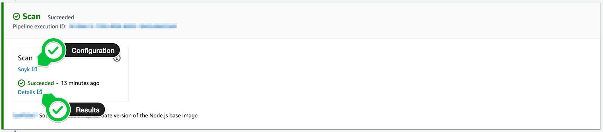
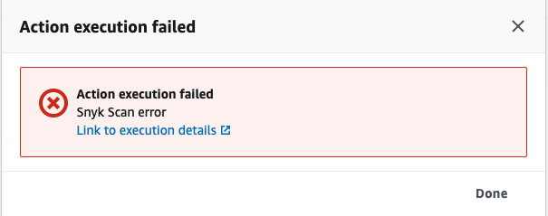

# View AWS CodePipeline scan results

You can view scan results in the AWS CodePipeline console, by clicking **Details** in the Scan stage:

Click the **link to execution details** to view your detailed vulnerability report as shown in the following screenshot.

##
