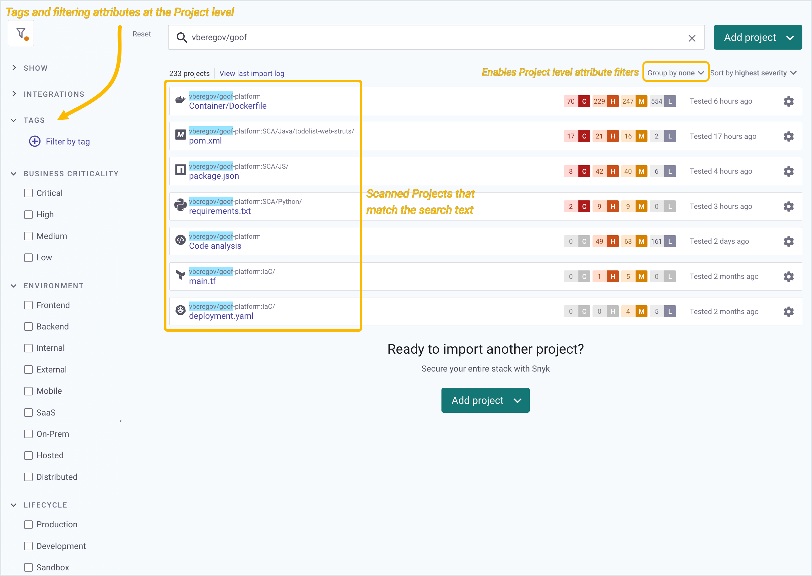

# Snyk Projects

## Introduction

Snyk Project information appears in the **Projects** menu in the Snyk dashboard. The filters that are visible depends on the grouping option you choose. &#x20;

<figure><figcaption>
The Projects menu in the Snyk Web Ui
</figcaption></figure>

Project components include **Targets**, **Origins**, **Projects, Targetfiles** and **Types**.

### Targets

Projects are held in a Target.

Targets represent an external resource Snyk has scanned: a code repository, a Kubernetes workload, or other scannable resources external to Snyk. Targets appear in the **Projects** menu on the Snyk dashboard when you select **Group by target**.&#x20;

Each Snyk Project is associated with a parent Target. One Target may include many Projects. The structure of the Target depends on the origin.

The grouping option controls whether your filtering attributes are applied at the Target or at the Project level. **Group by none** (ungrouped) lets you apply [tags](project-tags.md) and [filtering attributes at the Project level](project-attributes.md), to the individual Projects.

<figure><figcaption>
Group by target applies filtering attributes at the Target level
</figcaption></figure>

Snyk provides pagination to improve the page loading time for Projects page requests and filtering, which is particularly relevant if you have hundreds of thousands of Projects to scan.&#x20;

Use **Sort by** to list your Projects by severity, by how recently they were imported, or in alphabetical order.

&#x20;


Targets also appear on the [Snyk API](https://apidocs.snyk.io/?version=2022-02-16%7Ebeta#tag--Targets).


### Origin

The origin defines the Target ecosystem, such as CLI, GitHub, or Kubernetes. Origins are a property of [Targets](./#targets) and appear in the Projects menu as an icon next to the target name.

<figure><figcaption>
An origin defines the Target ecosystem
</figcaption></figure>

Possible origin values are:

* acr
* api
* artifactory-cr
* aws-config
* aws-lamba
* azure-functions
* azure-repos
* bitbucket-cloud
* bitbucket-server
* cli
* cloud-foundry
* digitalocean-cr
* docker-hub
* ecr
* gcr
* github
* github-cr
* github-enterprise
* gitlab
* gitlab-cr
* google-artifact-cr
* harbor-cr
* heroku
* ibm-cloud
* kubernetes
* nexus-cr
* pivotal
* quay-cr
* terraform-cloud

### Projects

Snyk Projects define the items (such as manifest files) that Snyk scans for a given Target, with configuration information defining define how to run that scan.

Projects appear in the **Projects** menu on the Snyk dashboard and in the [Snyk API](https://apidocs.snyk.io/?version=2022-02-16%7Ebeta#tag--Projects). \
Use **Group by none** (ungrouped) for better Project visibility and to apply [filtering attributes at the Project level](project-attributes.md).&#x20;

<figure><figcaption>
Project level filtering attributes
</figcaption></figure>

## Targetfile

The specific item to scan in a target, such as a **pom.xml** file in a GitHub repo.


[Snyk Code](https://docs.snyk.io/snyk-code) scans do not use targetfiles.


## Type

The scanning method to use for this project, such as Static Application Security Testing ([SAST](https://snyk.io/learn/application-security/sast-vs-dast/)) for scanning using Snyk Code, or Maven for a Maven project using Snyk Open Source. Part of the configuration for scanning.
