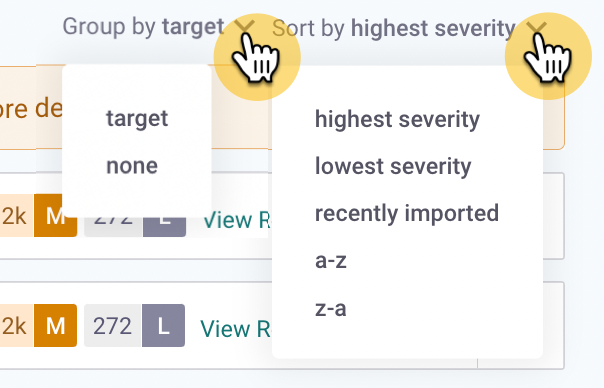

# Snyk Projects

## Introduction

Snyk Project information appears in the **Projects** menu in the Snyk dashboard. The filters that are visible depend on the grouping option you choose.


After filters have been applied to the project listing page, you can bookmark the URL and share it with other users in the Organization. This allows all users to see the same view of the page.


<figure><figcaption>
Projects listing in the Snyk Web Ui
</figcaption></figure>

Snyk Projects concepts include **Target**, **Origin**, **Project, Targetfile**, and **Type**.

## Target

Projects are held in a Target. Targets are displayed in the Snyk Web UI. You can also find Targets using the Snyk REST API endpoint [Get targets by org ID](https://apidocs.snyk.io/?version=2022-12-21%7Ebeta#get-/orgs/-org\_id-/targets).

A Target represents an external resource Snyk has scanned: a code repository, a Kubernetes workload, or other scannable resource external to Snyk. Targets appear in the **Projects** menu on the Snyk dashboard when you select **Group by target**.

Each Snyk Project is associated with a parent Target. One Target may include many Projects. The structure of the Target depends on the Origin.

The grouping option controls whether your filtering attributes are applied at the Target or at the Project level. **Group by none** (ungrouped) lets you apply [tags](project-tags.md) and [filtering attributes at the Project level](project-attributes.md) to the individual Projects.

<figure><figcaption>
Group by target applies filtering attributes at the Target level
</figcaption></figure>

Snyk provides both pagination to improve the page loading time for Projects page requests and filtering, which is particularly helpful if you have hundreds of thousands of Projects to scan.

Use **Sort by** to list your Projects or Targets by severity, by how recently they were imported, or in alphabetical order.

<figure><figcaption>
Sort by severity
</figcaption></figure>

## Origin

The Origin defines the Target ecosystem, such as CLI, GitHub, or Kubernetes. Origins are a property of [Targets](./#targets) and appear in the Projects menu as an icon next to the Target name.

<figure><figcaption>
Origin icon next to the Target name
</figcaption></figure>

Possible Origin values are:

* acr
* api
* artifactory-cr
* aws-config
* aws-lamba
* azure-functions
* azure-repos
* bitbucket-cloud
* bitbucket-server
* cli
* cloud-foundry
* digitalocean-cr
* docker-hub
* ecr
* gcr
* github
* github-cr
* github-enterprise
* gitlab
* gitlab-cr
* google-artifact-cr
* harbor-cr
* heroku
* ibm-cloud
* kubernetes
* nexus-cr
* pivotal
* quay-cr
* terraform-cloud

## Project

A Snyk Project defines the items, such as manifest files, that Snyk scans for a given Target, with configuration information defining how to run that scan.

Projects appear in the **Projects** menu on the Snyk dashboard. You can also find Projects using the Snyk REST API endpoint [Get projects by org ID](https://apidocs.snyk.io/?version=2022-12-21%7Ebeta#get-/orgs/-org\_id-/projects).

Use **Group by none** (ungrouped) for better Project visibility and to apply [filtering attributes at the Project level](project-attributes.md).

<figure><figcaption>
Filtering attributes applied at the Project level
</figcaption></figure>

## Targetfile

The Targetfile is the specific item to scan in a Target, such as a `pom.xml` file in a GitHub repo.


[Snyk Code](https://docs.snyk.io/snyk-code) scans do not use Targetfiles.


## Type

The Type is the scanning method to use for a particular Project, such as Static Application Security Testing ([SAST](https://snyk.io/learn/application-security/sast-vs-dast/)) for scanning using Snyk Code, or Maven for a Maven project using Snyk Open Source. This is part of the configuration for scanning.

