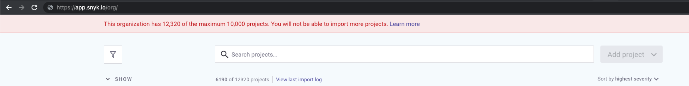

# Maximum number of projects in an organization

Depending on the type of plan you have with Snyk you will have a limit on the number of projects you can have in a single organization.

| Plan       | Number of Projects |
| ---------- | ------------------ |
| Free       | 10,000             |
| Team       | 25,000             |
| Business   | 25,000             |
| Enterprise | 25,000             |

### How will you know when you have reached the limit?

When you reach that limit, Snyk will stop importing more projects into the organization.

You will know you have hit this limit when you see this banner in the Snyk UI:



In the CLI, your `snyk monitor` command will return the following error

> `Maximum number of projects reached for this organization. You cannot import more projects.`

In the API, your import request will return this error:

```
"data":{
        "code":400,
        "message":"This organization has 25000 of the maximum 25000 projects. You will not be able to import more projects: https://docs.snyk.io/getting-started/introduction-to-snyk-projects/maximum-number-of-projects-in-an-organsation",
        "errorRef":"5bc3fb50-cbcd-4c15-81f6-b183fc95d10f"
    },
```

This limit is in place to protect your experience with Snyk. There are no restrictions on the number of organizations you can create. If you are getting close to these limits, you can create more organizations and split your projects across them.
