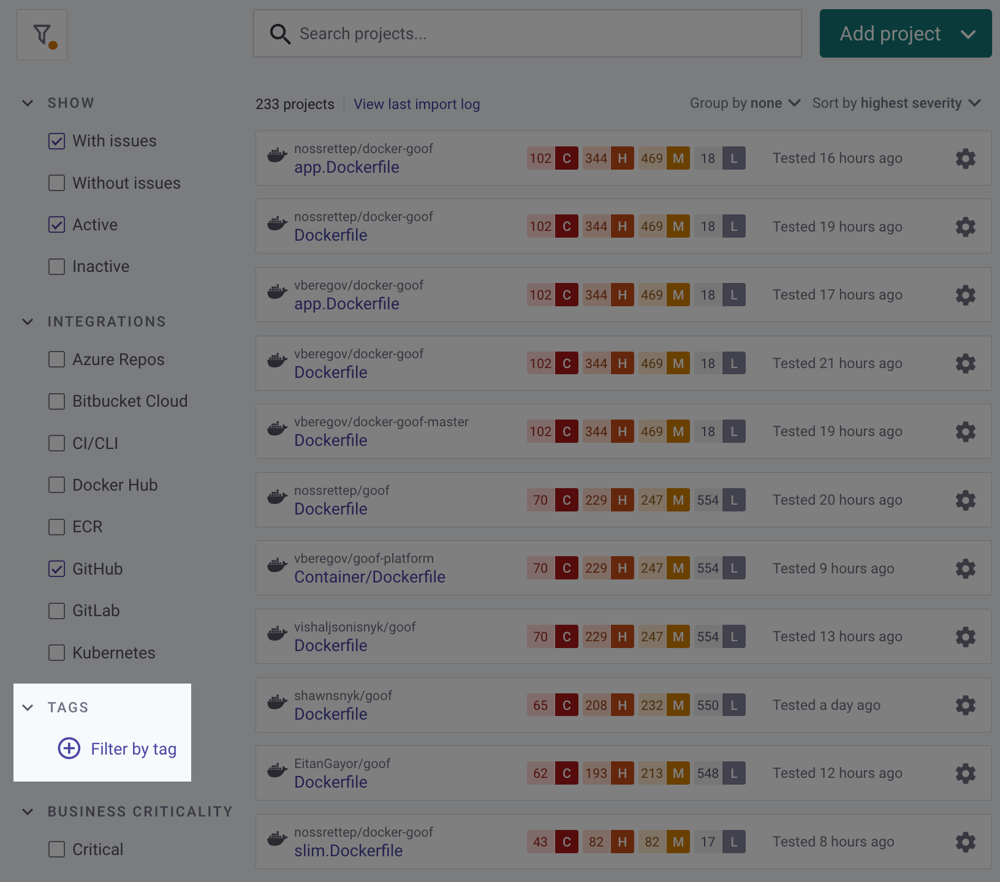

# Project tags


**Feature availability**\
Project tags are available for Business and Enterprise plans. See [pricing plans](https://snyk.io/plans/) for more details.


A tag is a key and value combination that lets you add additional custom metadata to Projects on the Project issues page.

* Keys are limited to 30 characters
* Values are limited to 50 characters
* Both keys and values allow only alphanumerics and the following characters **`-`**, **`_`**
* You can create 1000 unique key and value combinations per group, and apply 10 unique tags per Project
* Reusing a key and value combination does not add to the count

## Tag actions

Using the Snyk Web UI and Snyk API, you can perform the following actions:

* Create tags for Projects
* Assign and remove tags from Projects
* Filter Projects on the Project listing page

The Group and Organization admins can perform all actions, while a Collaborator can perform the actions if they are in an Org which is part of a Group.

## **Creating tags**

To create a new tag for a Snyk Project:

1.  On the Project issues page, click **Add a key/value...**\
    ****

    <figure><figcaption>
Modifying Project tags
</figcaption></figure>
2. Add your new key and click **Enter**.
3. Add a new value and click **Enter**.

You have created a new tag. When a new tag is created, it is automatically assigned to the Project it was created in. The tag can also be used for any other Project in your group.

You can apply multiple values to the same key.

## **Assigning and removing tags from a Project**

If a tag exists in your group, you can apply it to any Snyk Project.

1. Click the **⊕** (add icon) in the tags section.
2. You can either select a key from the list of recently used keys or type out the key which is part of the tag you want to assign to your Project.
3. You can either select a value from the list of recently used values or type out the value which is part of the tag you want to assign to your Project.
4. After you select the value, the tag is assigned to your Project.
5. To remove a tag from a Project, click the **x** (remove icon) for the tag.

## Filter Project by tags

You can filter Projects by tags in the **Group by none** (ungrouped) view.

<figure><figcaption></figcaption></figure>

<figure><figcaption></figcaption></figure>


**Filter by tag autocomplete**: this field is intentionally limited to a small number of results. If your tag isn't displayed, enter more characters for the tag until it rises to the top of the results.

