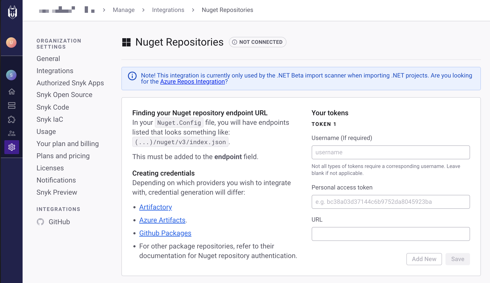

# Improved .NET scanning


Feature availability

Improved Snyk Open Source scanning for NuGet .NET applications is in Early Access and available with Enterprise plans. For more information, see [Plans and pricing](https://snyk.io/plans/).

You can enable the feature by using [Snyk Preview](../../../snyk-platform-administration/snyk-preview.md).



While in Early Access, this feature potentially can cause scans to fail or produce different results. Snyk recommends gradually enabling this feature, for example, starting with a subset of your Organizations. For more information, see [Enterprise setup](../../../implementation-and-setup/enterprise-setup/).

You can report issues by submitting a [support ticket](https://support.snyk.io).


## Limitations of existing solution

The existing .NET scanning solution for SCM integration in the Snyk Web UI and CLI uses two [different approaches](guidance-for-snyk-for-.net.md#dependency-analysis). The Dependency Analysis for SCM integrations can produce [false positives](guidance-for-snyk-for-.net.md#build-time-versus-runtime-dependencies) that have no remediation available and must be manually ignored.

If you use the CLI to scan Projects, you can expect more accurate results compared to importing the same Project using an SCM integration. You can [encounter errors](troubleshooting-snyk-for-.net.md) when scanning Projects that use specific .NET features.

## Scanning improvements

Snyk improved the .NET scanning process to ensure that dependency results are consistent across the CLI and SCM integrations. This update also eliminates false positives from runtime dependencies that were previously displayed in the UI. The approach involves using the internal workings of the .NET ecosystem.

The improved .NET scanning also provides the capability of scanning any Project that can be successfully built by the `dotnet` SDK itself, removing the previous limitations of not being able to scan Projects using certain .NET features, such as `.props` files, `global.json`, or Central Package Management.

## .NET scanning improvements for SCM integrations


Snyk Broker is not supported.


The .NET scanning improvements are available when importing Projects using Git repository integrations.

Follow these steps to enable the improvements:

1. Activate improved .NET scanning for your Organization or Group through the [Snyk Preview](../../../snyk-platform-administration/snyk-preview.md) menu.
2. Re-import any repositories with .NET applications; re-testing existing Projects is not sufficient.

### Private package repository integration

Since the improved .NET solution will build your .NET Project, Snyk requires access to any private NuGet repositories.

The recommended approach is to use [`nuget.config`](https://learn.microsoft.com/en-us/nuget/reference/nuget-config-file) files along with registering the credentials in Snyk NuGet private package repository integration (**Settings** > **Integrations** > **NuGet**).

<figure><figcaption><p>Set up Nuget Repositories from the Settings, Integrations screen</p></figcaption></figure>

If you are not using `nuget.config`, but another way of informing the .NET ecosystem of where to look for private packages, Snyk will attempt to add all private NuGet repository credentials defined in the private package repository integration as a `dotnet nuget` source before restoring the Project.

Fill in the **Your tokens** fields by adding a **Username**, the **Personal access token**, and the repository **URL** (supports only HTTPS sources).&#x20;

For more information, see [Package repository integrations](../../../scan-with-snyk/snyk-open-source/package-repository-integrations/).

### Limitations on improved .NET scanning for SCM integrations

* `Directory.Build.props`, `global.json` and other .NET-specific manifest files are supported, but the file names must use upper and lower case, as Microsoft [describes](https://learn.microsoft.com/en-us/visualstudio/msbuild/customize-by-directory?view=vs-2022#directorybuildprops-and-directorybuildtargets).
* For `global.json`, Snyk does not support all `major.minor.patch` versions that are currently supported by Microsoft, only a subset thereof. For more information, see this [error code](../../../scan-with-snyk/error-catalog.md#snyk-os-dotnet-0008).
* The operations are performed on a case-sensitive file system, meaning manifest definitions like your `<ProjectReference>` strings must match files and folders with the same case.
* Snyk does not support Projects that use Visual Studio Build Tools.
* Snyk does not support Windows-specific frameworks (WPF, WCF) for .NET Projects.
* Projects with downloaded dependencies totaling more than 10GB are not supported.

## .NET scanning improvements for the Snyk CLI

The .NET scanning improvements are also available in the Snyk CLI for both the [snyk test](../../../developer-tools/snyk-cli/commands/test.md) and [`snyk monitor`](../../../developer-tools/snyk-cli/commands/monitor.md) commands.

Follow these steps to enable the improvements:

1. [Install](../../../developer-tools/snyk-cli/install-or-update-the-snyk-cli/) the latest version of the CLI.
2. Run `dotnet restore`.
3. Scan your .NET Projects using `snyk test` or `snyk monitor` as usual, but add the `--dotnet-runtime-resolution` option.

The `--dotnet-runtime-resolution` option works with`--all-projects`.

Example: `snyk test --dotnet-runtime-resolution`

The Improved .NET scanning for the CLI supports multiple target frameworks in your build manifests.

By default, the solution scans all target frameworks. If you want to scan individual target frameworks, you must add the `--dotnet-target-framework=<targetFramework>` option to your CLI command.

Example: `snyk test --dotnet-runtime-resolution --dotnet-target-framework=net8.0`

## .Net scanning methods for CLI and SCM

When Snyk scans your Project with Improved .NET, an environment variable named `SnykTest` becomes available. You can use this environment variable to create conditionals to avoid executing tools that might break the scan. The following example uses the `SnykTest` variable to avoid running the swagger command:


```
<Target Name="GenerateSwaggerFiles" AfterTargets="Build" Condition="'$(SnykTest)' != 'true'">
    <Exec Command="<dotnet-swagger-command>" />
</Target>
```


## Supported .NET versions

The improved .NET scanning feature supports:

* .NET 6, 7, 8 and 9
* All versions of .NET Standard

If you import an unsupported .NET Project using an SCM integration, the improved .NET scanning feature will not be enabled and will fall back to the legacy scanning method.

The `<TargetFramework>` used must be compatible with what is [currently supported by Microsoft](https://learn.microsoft.com/en-us/dotnet/standard/frameworks#supported-target-frameworks) in order to be correctly picked up by Snyk scanners.
