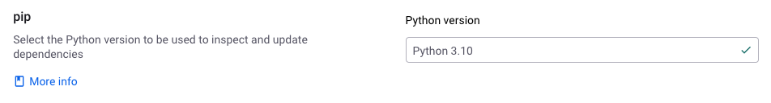

# SCM integrations and Python

## Set the Python version in Git Projects

The supported versions of Python are `2.7`, `3.7`, `3.8`, `3.9`, `3.10`, `3.11`, `3.12`, `3.13`.

When scanning Pip Projects imported from Git, Snyk uses the version of Python specified in Organization settings or `.snyk` files.


It is important to specify the correct Python version for your Organization, as it can affect the version of dependencies used in scanning your Projects.


Snyk uses a recent `patch` version for each of the supported `minor` version.

By default, Snyk tests Pip Projects using Python 3.7.


The behavior of imports, re-tests, and PR checks for Projects with dependencies requiring a higher version of Python varies according to the version specified:

* Python 3.8 or above: scans will fail with an [error](../../../scan-with-snyk/error-catalog.md) message that includes details of the first failed package, the Python version it requires, and the Python version used.
* Python 2.7 or 3.7: scans will succeed, but the incompatible dependencies are omitted from the results.


To define which Python minor version Snyk uses to test your Git-imported Pip Projects, you can use Organization settings and [`.snyk` policy file](../../../manage-risk/policies/the-.snyk-file.md).

To define the Python version for all Projects in an Organization:

1. Log in to your Snyk account and navigate to the relevant Group and Organization.
2. Select **Settings** > **Snyk Open Source**.
3. Select **Edit settings** for **Python**.
4. From the **Python version** dropdown, select the Python version to use when testing Projects for this Organization.

<figure><figcaption><p>Pip Python version settings</p></figcaption></figure>

If you require a Project in an Organization to use a different Python version, you may add a `.snyk` file to the Project repository and specify the desired version.

```python
language-settings:
  python: '3.10'
```

The `.snyk` file must be in the same directory as the Project manifest file.

Snyk will select which Python version to use according to the `major`, `minor` and `patch` versions specified in the `.snyk` file.

* `Major` version only (for example, 2 or 3): scanned with default `minor` versions - 2.7 or 3.7
* `Major` and `minor` version (for example, 3.7, 3.8, 3.9, 3.10, 3.11, 3.12, 3.13): scanned with 3.7, 3.8, 3.9, 3.10, 3.11, 3.12, or 3.13
* `Major`, `minor` and `patch` version (or example, 3.8.x, 3.9.x, 3.10.x, 3.11.x, 3.12.x, 3.13.x): the specific `patch` version is ignored, the Project is scanned with default versions of 3.8, 3.9, 3.10, 3.11, 3.12, or 3.13
* Any versions specified with an unsupported `minor` version: defaults to 2.7 or 3.7

## SCM integration and Snyk for Python


Python packages that are operating system-specific and not supported by Linux may not be compatible with Snyk SCM scans, leading to errors.


To scan your Projects, you must ensure your repository contains the supported manifest files.

### Pip and SCM repositories

The following dependencies are not supported and are removed before the file is scanned. The remaining dependencies are included in the scan.

* Private PyPI repos
* `file://`, regular URLs, relative paths, and more generally URIs in `requirements.txt` files
* Setting a different package index with `--index-url`, `-i`, `--extra-index-url`&#x20;
* Specifying dependency archive locations with `--find-links`, `-f`
* Installing a dependency in editable mode with `--editable`, `-e`&#x20;
* Relying on a version constraints file with `--constraint`, `-c`
* Including another requirement file with `--requirement`, `-r`&#x20;
* Specific packages: `virtualenv` and `pip` for Python 2.7 and 3.7


Projects with downloaded dependencies totalling more than 10GB are not supported.


To scan Pip Projects, Snyk analyzes your `requirements.txt` files using native `pip` tooling in an isolated Linux environment.

Pip Projects scanned using the SCM integration will be given the same name as the directory where they are located.&#x20;

Snyk imports any file that follows the `**/*req*.txt` pattern. This can help if you have renamed the `requirements.txt` files, for example, to `requirements-dev.txt`.

Snyk also looks for files using the `**/requirements/*.txt` pattern. This can help if you have placed your files in a `requirements` folder, for example, `requirements/requirements.txt`.

If you are using a package manager that creates different manifest file formats from `requirements.txt`, then you may be able to convert or export the manifest file to the `requirements.txt` format.

An example follows of how `dephell` is used to convert from Conda `environments.yml` to a `requirements.txt`.

```python
dephell deps convert --from=conda --to=requirements.txt
```

### Poetry and SCM repositories

Poetry v1 and v2 are supported.

To scan Poetry Projects, Snyk inspects your `pyproject.toml` and `poetry.lock` files.

You can choose whether Snyk should include [dev dependencies](https://python-poetry.org/docs/managing-dependencies/) when scanning your Poetry Projects.

Snyk regards non-dev dependencies to be those declared in `tool.poetry.dependencies`, the implicit `main` group. All others are classed as dev dependencies.

Poetry dev dependencies are not included in scans by default. To change this, modify your settings as follows:

1. Log in to your Snyk account and navigate to the relevant Group and Organization.
2. Select **Settings** > **Languages**.
3. Select **Edit settings** for **Python**.
4. Enable or disable the **Scan Poetry dev dependencies** option under the **Poetry dev dependencies** settings.&#x20;

<figure><figcaption><p>Poetry dev dependency settings</p></figcaption></figure>

### Pipenv and SCM repositories


Private PyPI mirrors are not supported. `Pipfiles` specifying a private mirror as their only source will not be imported.


To scan Pipenv Projects, Snyk analyzes your `Pipfile` and `Pipfile.lock` files using native `pipenv` tooling in an isolated Linux environment.


Packages from private repositories and those with non-Linux OS requirements may be unresolvable and omitted from the dependency tree.

If a `Pipfile.lock` is present, any unresolved packages it contains are added to the top level of the dependency tree using versions from the lock file.&#x20;


You can choose whether Snyk should include dependencies specified in `[dev-packages]` when scanning your Pipenv Projects.

Pipenv dev dependencies are not included in scans by default. To change this, modify your settings as follows:

1. Log in to your Snyk account and navigate to the relevant Group and Organization.
2. Select **Settings** > **Languages**.
3. Select **Edit settings** for **Python**.
4. Enable or disable the **Scan Pipenv dev dependencies** option under the **Pipenv** settings.&#x20;

<figure><figcaption><p>Pipenv dev dependency settings</p></figcaption></figure>
