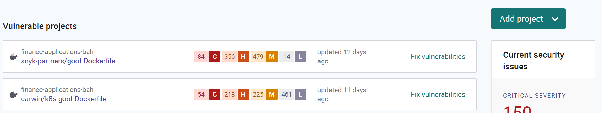
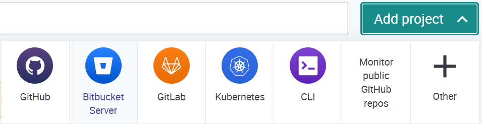

# Importing Projects into Snyk

Navigate to snyk.io for your organization and click **Add project**:

With you enable the broker integration, you see a new option to add projects, **Bitbucket Server**:

Click on **Bitbucket Server** to see the project import screen. Snyk queries your Bitbucket Data Center instance for the projects visible to the login you provided, and displays them for selection. This example shows the final project associated with one of our members' repositories:

.png>)

For this tutorial, we'll import both repositories under the project: you can choose fewer or additional files if needed:

Clicking **Add selected repositories** to import all those projects to Snyk.io, and initiate a scan operation.

This scan brings your privately hosted repository into Snyk, where the outputs follow the same style and patterns as imports from other private or public repositories.

For example, the next page is from a repository in Bitbucket Data Center, but the results are equivalent to similar solutions, with the lone distinction that Bitbucket Server is identified as the source:

 (1).png>)


For those users familiar with Snyk and its various demonstration environments, you should recognize the popular **goof** application in the example above.

