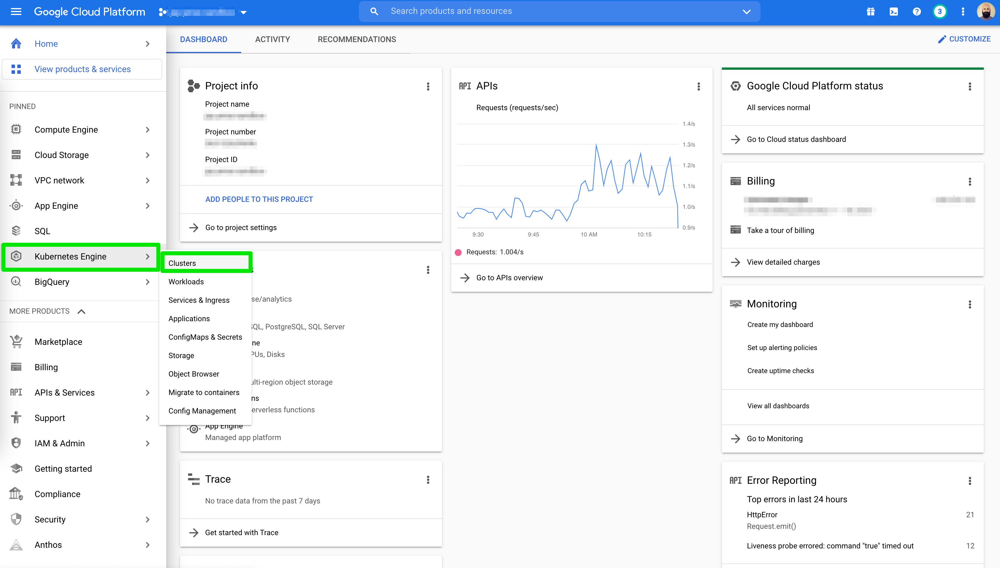
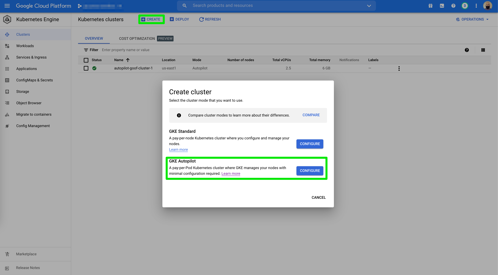
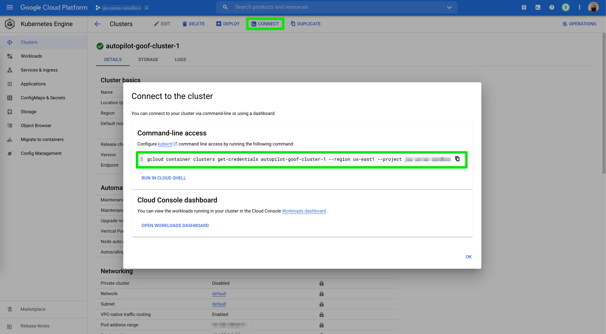

# Provision your cluster

Navigate to your [GCP Console](https://console.cloud.google.com/kubernetes) and select **Kubernetes Engine** then **Clusters** from the menu options.

Select **Create** from the top menu and **Configure** a GKE Autopilot cluster. For the purpose of this tutorial we can accept all default values.

Once our cluster is ready, click on **Connect** from the top menu and copy & paste the command into your terminal window.

You can verify connectivity by running a simple `kubectl get nodes` command where you should see a list of nodes prefixed with the name you selected at time of cluster creation.
