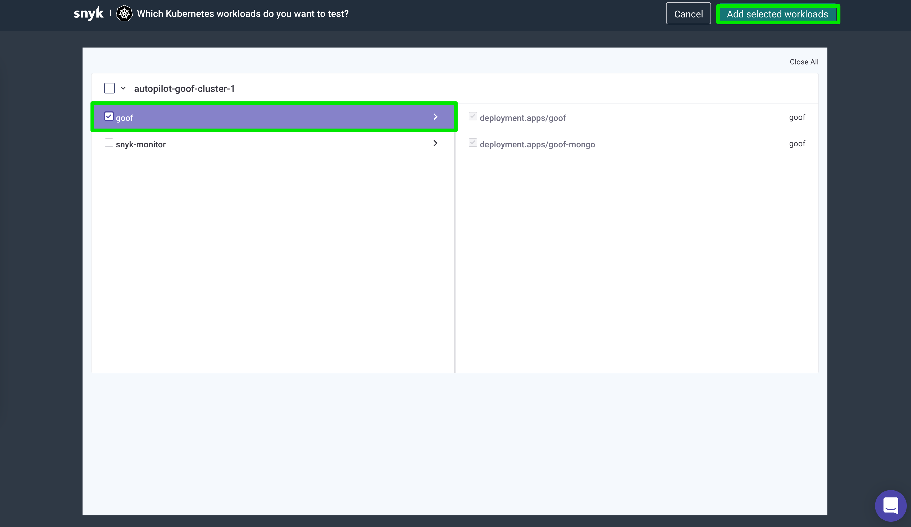
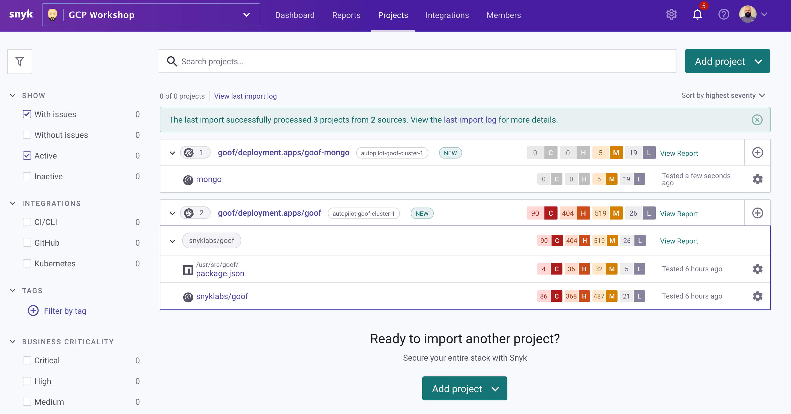
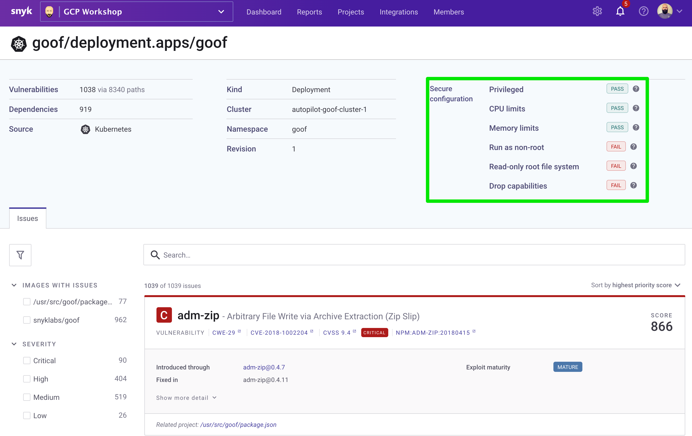
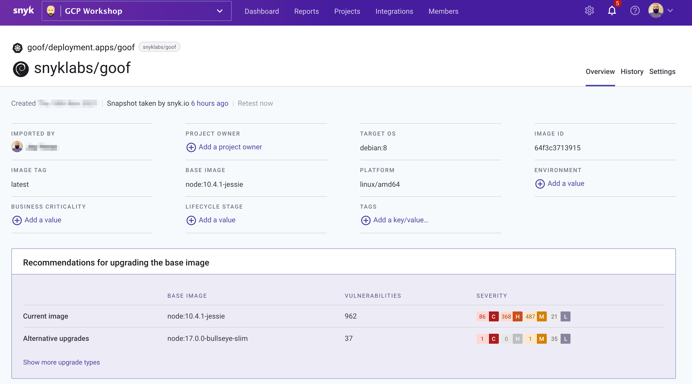
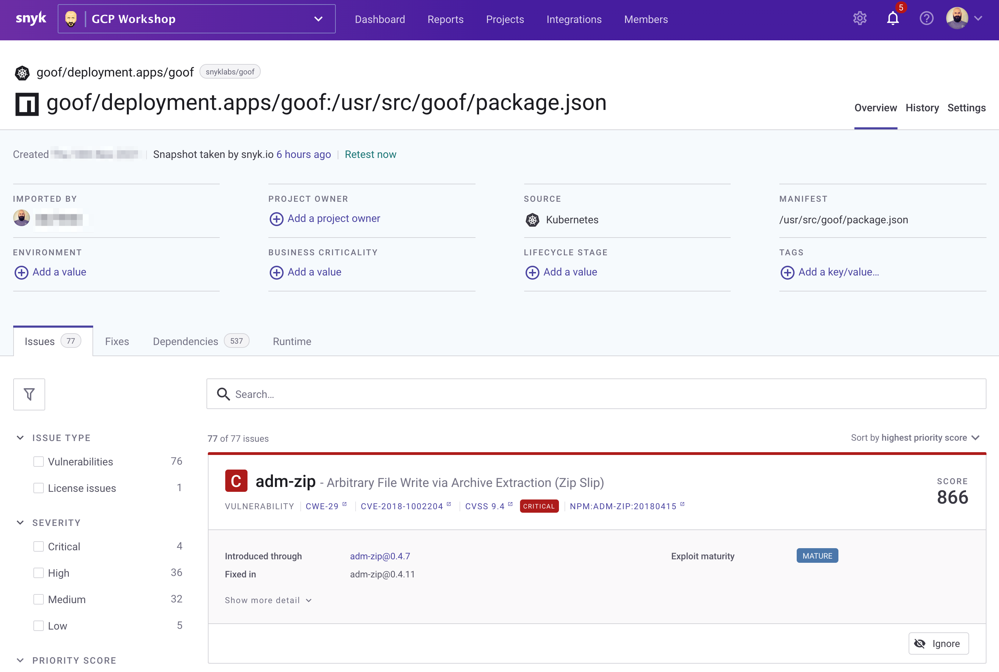

# Security findings

Now that we have some workloads running on our OKE cluster and deployed Snyk, we can analyze these for insights into:

* Issues in open source libraries.
* Base image upgrade recommendations.
* Application misconfigurations.

As well as other features critical to running a secure environment available with [Snyk Container](https://snyk.io/product/container-vulnerability-management/).&#x20;

### Scan Workloads

Login to [Snyk](https://snyk.co/udrgA) and navigate to the **Integrations** menu where you will click on the **Kubernetes** section. Select our cluster and desired namespace (in this case these are both named **goof**) then click the **Add selected workloads** button as shown below:

Detailed instructions on adding Kubernetes workloads are available in our [Documentation Pages](https://docs.snyk.io/products/snyk-container/image-scanning-library/kubernetes-workload-and-image-scanning/adding-kubernetes-workloads-for-security-scanning).

### Project status

Once selected, you will be redirected to the main projects page where you will find a summary of the findings grouped by project as shown below:

From this view, you can drill into each category and examine the findings. Let's start with misconfigurations of our cluster.&#x20;

Here we see that our application was deployed with various settings that were either not defined or incorrectly defined. For example, whether any containers in the workload have `container.securityContext.runAsNonRoot` set to `false`, or unset. These can be resolved by updating the Kubernetes manifest files for the deployment and can be resolved proactively with one of the many Snyk [Source Code Management (SCM) integrations](https://docs.snyk.io/features/integrations/git-repository-scm-integrations).

Next, let's examine our container image.

Here we are provided with a base image upgrade recommendation that takes into account which image is compatible with our application and reduces the number of vulnerabilities to improve our security posture.

Finally, let's examine our open source dependencies and found vulnerabilities.

In this view, we get detailed contextual data on found vulnerabilities along with [Snyk's Priority Score](https://snyk.io/blog/snyk-priority-score/) which helps to drastically simplify one of the biggest challenges in using open source securely—working out which vulnerabilities to tackle first.
