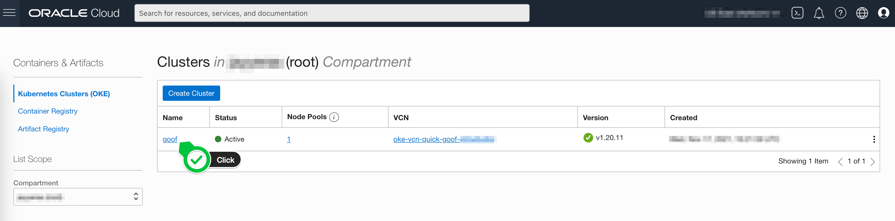
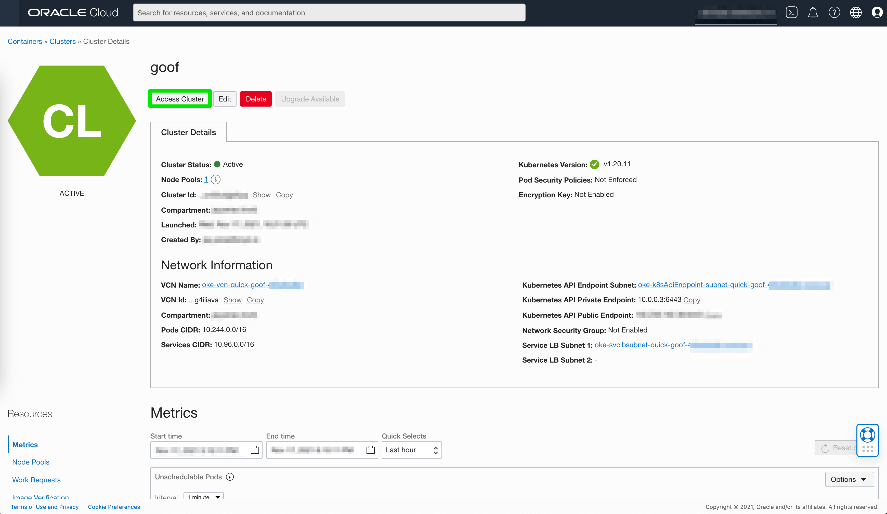
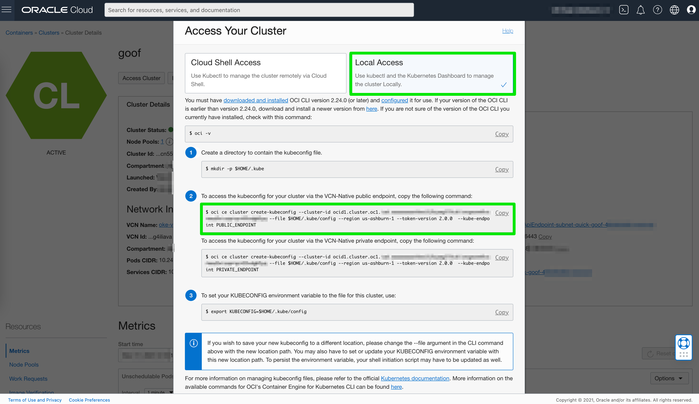

# Accessing your cluster

Once you have provisioned your OKE cluster, you can navigate to **Developer Services** and **Kubernetes Clusters (OKE)** as shown below:


Find the cluster you wish to interact with and click on its name as shown below:



Click on the **Access Cluster** button to display details:



For this tutorial we will opt for **Local Access** and apply the command(s) below to configure our local environment to interact with the Kubernetes API:




You will need to have [kubectl](https://kubernetes.io/docs/tasks/tools/) installed.


You can test by running the following command from your terminal:

```bash
kubectl get svc
```

If everything is working you should see a response displaying some data like cluster name, IP etc.
