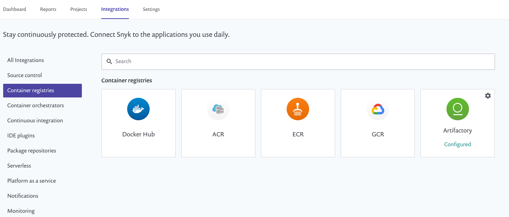

# Configure Docker Hub integration

## Configure integration for Docker Hub

Enable integration between Docker Hub and Snyk, and start managing your vulnerabilities.

1. From the Snyk UI, log in to your account and navigate to Integrations from the menu bar at the top.
2. From the Integrations page click the Docker Hub box (image 1)
3. From the **Settings** page in the Integrations area, enter your Docker Hub username and Access Token and then click **Save** (image 2)

  (1) (1) (1) (1) (1) (1) (1) (1) (1) (1) (1) (1) (1) (1) (1) (2).png>)

_As the access token, you can either use your DockerHub password or an access token_ [_created_](https://docs.docker.com/docker-hub/access-tokens/) _in DockerHub. In case 2FA is activated on your account, access token **only** is applicable._

Snyk tests the connection values and the page reloads, now displaying Docker Hub integration information and the Add your Docker Hub images to the Snyk button.

A confirmation message that the details were saved also appears in green at the top of the screen. In addition, if the connection to Docker Hub failed, a notification appears.
