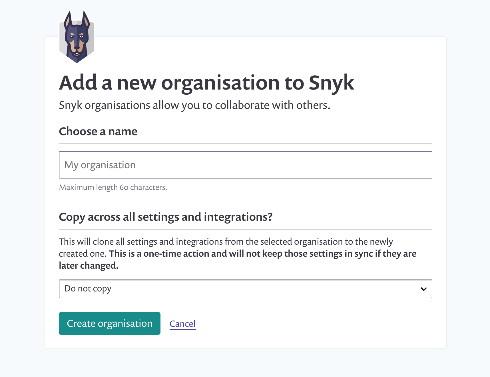

# Manage Snyk organizations

In the **Manage organization** section, you can:

* see how many private, public and inactive projects are in the organization.
* see and manage team members.
* leave this organization.
* delete this organization \(administrator users only\).

## Create a new Snyk organization

You can have an unlimited number of organizations on Snyk. Each organization can be on a different pricing plan.

To create a new organization, choose the ‘Create’ link in the drop-down in the top navigation. You can then name the organization and start a trial.

