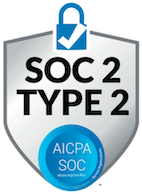
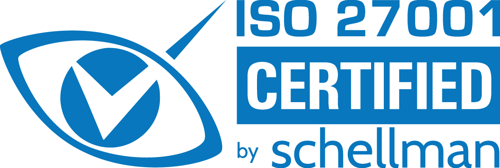

# How Snyk handles your data

Snyk is a developer security platform designed to place the utmost importance on data security. This document aims to provide you with transparency as to how and what data is accessed, transferred, and stored by Snyk in connection with our services.

The data that Snyk handles varies depending on the product you are using, how you are integrating with Snyk and your Snyk deployment. Snyk is, however, subject to fast-moving changes. Therefore, the types of data that Snyk accesses and stores might change with the introduction of a new capability or changes to an existing capability.

## Flexible deployment options

Snyk's cloud-first deployment options offer ease of use and scalability while also including standard data protection measures. Snyk supports multi- and single-tenant options in the US, EU, and AU regions.

Snyk deployment options are as follows:

* **Multi-Tenant SaaS:** The simplest, most common, and most cost-effective way to use Snyk’s developer security platform.
* **Single-Tenant SaaS:** Private Cloud - An isolated and fully managed instance of the Snyk developer security platform. For details, see [Snyk Deployment Options](https://snyk.io/platform/deployment-options/).
* **Snyk Broker:** A client service installed on your private infrastructure, acting as a proxy between the Snyk developer security platform (multi- or single-tenant) and your on-premise codebase. [Snyk Broker](../enterprise-setup/snyk-broker/) is designed to securely handle inbound and outbound connections, encrypting data during transit and deliberately controlling the access Snyk has to your data. Sensitive credentials stay behind your firewall.

## Customer data within Snyk

Snyk provides a wide range of development tools and integration points, requiring different types of data and involving different data interactions. The following sections provide an overview of both the common types of data Snyk accesses and stores, and product and integration-specific details. The information is reviewed regularly, including when a significant change occurs within the product.

## Common data types

* **Vulnerability data:** Snyk stores information on the vulnerabilities identified in customer applications and related fix context.
* **Vulnerability source:** Snyk stores information on where the vulnerability was identified. Examples: source code repository or registry, file name and location, dependency tree, vulnerability path.
* **Integration-related data:** Snyk stores information required to set up an integration with Snyk. Examples: tokens and API configurations.
* `User data:` Snyk stores user information required to access and use the platform. Examples: user name, IDs (for example, GitHub user ID), email address, IP address.
* **User list:** For purposes of accurate contributor counting, Snyk accesses commits from the last 90 days for repositories monitored. Upon request, an unhashed version of user emails is produced.
* **Billing data:** Snyk stores information required for billing your Snyk account.
* **User behavior analytics:** Snyk stores various types of information pertaining to usage patterns. Examples: platform navigation and executed CLI commands.


All data is handled by Snyk in accordance with the SOC 2 standard. For more details, see [Snyk certifications](how-snyk-handles-your-data.md#snyk-certifications).


### Cache retention period related to vulnerability source data

Snyk uses cloud products from Amazon Web Services (AWS) and Google Cloud Platform (GCP) to process and store the vulnerability source data in a cache. Such data is cached according to the shortest possible duration afforded by the cloud service provider's storage lifecycle policy, which is subject to change by these cloud service providers and set out approximately in the periods below:

* For AWS tenants - EU/AU/Private Tenant: 24 to 48 hours under the[ S3 policy](https://docs.aws.amazon.com/AmazonS3/latest/userguide/intro-lifecycle-rules.html)
* For GCP tenants - US (Default): 24 hours under the[ Google Cloud Storage Policy](https://cloud.google.com/storage/docs/lifecycle)

## Product-specific data types

The following provides details regarding data handling by specific Snyk products.

### **Snyk Open Source**

<figure><figcaption>
Snyk Open Source
</figcaption></figure>

#### Snyk Open Source product

* Snyk accesses manifest files, lock files, and related configuration files to identify your open-source dependencies.
* Snyk accesses your source code under these scenarios:
  * When [Workspaces for SCM integrations](../developer-tools/scms/workspaces.md) is enabled, Snyk ingests a short-lived, shallow clone of a [Git reference](https://git-scm.com/book/en/v2/Git-Internals-Git-References) and scans manifest files, lock files, and related configuration files in order to identify your open-source dependencies.
  * When CLI scans use the `--unmanaged` option, Snyk accesses your source code files to convert them to file signatures (hashes) and stores the file signatures and file names.
* Snyk accesses and stores the names and version numbers of your dependencies.
* Snyk stores the names of associated licenses, including copyright and attribution information.
* Snyk accesses and stores repository-specific information.
* Snyk accesses and stores Git provider push and pull-specific information. Examples: contributor name, filenames, timestamps.

#### Optional Snyk Open Source add-ons (opt-in)

Your account is subject to contract terms that might restrict your ability to enable these features. By enabling these features, you agree on behalf of your company to changes to your contract terms to allow these features, and you will be responsible for the use of these features based on your own circumstances.

* For the Go Modules full source code analysis feature, Snyk will access and store the contents of your Git repository to facilitate the building of an accurate dependency graph. After the Snyk analysis is complete, your code is deleted from the Snyk system.
* For the improved .NET scanning feature, Snyk will access and store the contents of your Git repository to facilitate the building of an accurate dependency graph. After the Snyk analysis is complete, your code is deleted from the Snyk system.
* For the Reachable Vulnerabilities feature, Snyk will access and store the contents of your Git repository to facilitate the building of a call graph. When the analysis completes, your code is deleted from the Snyk system. Only the call graph and function names are maintained.

### **Snyk Code**

<figure><figcaption>
Snyk Code
</figcaption></figure>

* &#x20;Snyk stores repository-specific information, for example, the name of the Git repository and file names. Snyk accesses your repository code for a one-time analysis and caches the source code according to the Cloud provider's storage minimum policy. After this period, only the location (file path, line, and column) of the issues found, the issue ID, and explanations are maintained. Your code is removed and is not stored in the Snyk network or logs.
* Results are stored in a database and used for analytic and monitoring purposes by Snyk.
* Snyk Code does not use any customer code (1) for engine training purposes or (2) to extract examples to show possible fixes.
* The AI model for Snyk Code Fix Suggestions is trained on public repositories with permissive licenses. Any data from repositories with changing licenses is immediately removed. Static analysis, automated assessment, and partial human labeling are used during the data collection.
* The scan results do not contain original source code but rather pointers to positions, for example, files, line and column numbers, and identification meta-information so that results are displayed using the correct source code version.
* Snyk stores repository-specific information, for example, the name of the Git repository and file names.
* The server infrastructure ensures separation between customers by using authentication and authorization. Snyk Code uses software controls to ensure customer data segregation. All communication is encrypted using high-grade industry-standard protocols.

### **Snyk Container**

<figure><figcaption>
Snyk Container
</figcaption></figure>

* Snyk accesses and stores package versions, executable hashes and versions, operating system, container image metadata (for example, rootfs hashes, history), and image ID.
* Snyk accesses and stores information pertaining to the parent image: name, version, and tag.
* Snyk accesses and stores RUN instructions from Dockerfiles.
* Kubernetes configurations: Snyk accesses workload security settings, for example, `run as root`. This is only accessed if you use the Snyk Kubernetes integration.
* Container registry integrations: Snyk accesses and then stores a short-term copy of the container image, unless a Broker is used. This copy is removed from the Snyk network after analysis.

### **Snyk IaC**

<figure><figcaption>
Snyk Infrastructure as Code
</figcaption></figure>

#### Current IaC

* CLI tests are performed locally. When results are shared with the Snyk platform using the `--report` option, resource configurations are also included.
* SCM tests require access to your infrastructure as code files. Snyk stores them for the duration of the analysis and subsequently deletes them from the Snyk system. Snyk retains parsed resource configurations to provide context for issues and resources.
* Terraform Cloud and Terraform Enterprise tests analyze plan files. Snyk removes secrets and sensitive values and retains resource configurations to provide context for issues and resources.
* For unmanaged resource detection using `snyk iac describe`, Snyk relies on the principle of least privilege and requires only read-only access to [AWS](../scan-with-snyk/snyk-iac/detect-manually-created-resources/configure-cloud-providers/configure-aws-provider.md#least-privileged-policy), [Azure](../scan-with-snyk/snyk-iac/detect-manually-created-resources/configure-cloud-providers/configure-azure-provider.md#least-privileged-policy), [Google](../scan-with-snyk/snyk-iac/detect-manually-created-resources/configure-cloud-providers/configure-google-provider.md#least-privileged-policy), or [GitHub](../scan-with-snyk/snyk-iac/detect-manually-created-resources/configure-cloud-providers/configure-github-provider.md#least-privileged-policy). Provider credentials are not sent to or stored by Snyk.
* Snyk relies on local read-only Terraform State file access and extracts and sends relevant resource configuration data to the platform.

#### IaC+

* Snyk Cloud scans cloud platform APIs to gather information on configured infrastructure deployed in AWS Accounts and Google Cloud Subscriptions.
* To perform scans, Snyk relies on the principle of least privilege, leveraging different authentication mechanisms that are supported by each Cloud platform.
  * For Amazon Web Services (AWS), a read-only AWS IAM role must be provisioned in your AWS Account(s) to provide secure access to required AWS APIs.
  * For Google Cloud, a read-only Google Cloud Service Account must be provisioned to enable secure access to the required Google Cloud APIs.
* During scans, Snyk gathers and stores a resource configuration state to perform analysis and stores the results of that analysis, including the details of misconfigurations that result in issues.
* Snyk Cloud retains resource configuration states found in scans to provide context for Issues and resources, but does not store secrets or sensitive values.

### Snyk Essentials and Snyk AppRisk

<figure><figcaption>
Snyk AppRisk
</figcaption></figure>

* Snyk Essentials and Snyk AppRisk provide visibility into data at the Snyk Group level and, therefore, cover the scope of all Snyk Organizations within a Snyk Group.
* From Snyk Targets and Projects within associated Snyk Organizations, both Snyk Essentials and Snyk AppRisk access and store asset metadata to generate code repository assets, package (first-party) assets, and container image assets. Asset metadata includes the Git remote URL, languages represented in repositories, and commit history metadata (not the underlying source code).
* From SCM integrations configured using the Integrations page, both Snyk Essentials and Snyk AppRisk access and store the following data:
  * Commit history metadata from the last 50 commits for repositories monitored, including profile information on the code committer, such as GitHub user IDs, display name, or email.
  * Metadata on the languages used for a given code repository, for example, Python, HTML, and so on.
  * Repository “topics,” which are represented as asset tags.
* From runtime data sources configured using Snyk AppRisk Integrations (including observability, CNAPP, and so on), Snyk AppRisk can access and store the following data:
  * Kubernetes resources (including, but not limited to, deployments, pods, and so on) that are present across the various clusters.
  * Application entities used in runtime, and how they are executed (for example, loaded into memory) - including but not limited to services and packages.
  * Metadata on files in the OS itself.
  * Information on the runtime and cloud environment.
  * HTTP request metadata, for example, hostnames, paths, and so on, that are flowing through the cluster.

### Snyk Learn

<figure><figcaption>
Snyk Learn
</figcaption></figure>

#### User data

Snyk Learn stores data related to users' progress and completion of lessons, learning paths, and assignments. This data is used to provide personalized learning experiences, generate progress reports, and improve our educational content. You can access your stored learning data through your [Learning Progress](https://learn.snyk.io/user/learning-progress) portal.

#### Snyk Assist for Snyk Learn

Snyk maintains important safeguards regarding the data processed by Snyk Assist:

* **Unintended code disclosure:** Snyk has implemented technical safeguards designed to check for code in user input; if found, code is not sent to the AI or stored by Snyk.
* **Usage data:** Snyk stores anonymized user input and usage analytics for a reasonable period.
* **Content filtering:** Measures are in place to handle inappropriate input, for your safety and that of Snyk.

### Snyk API & Web

<figure><figcaption>
Snyk Web &#x26; API
</figcaption></figure>

Snyk API & Web accesses and scans your web applications and APIs to identify security vulnerabilities through dynamic application security testing (DAST).

Snyk accesses and stores the following information:

* Website and API credentials that are required to authenticate and perform security scans.
* Target configurations, including sequences recorded by the browser plugin and specified paths to facilitate accurate scanning.
* Vulnerability data identified during scans.
* Requests and responses data: A sample of crawler requests and responses is stored, including a subset of scanner requests and responses indicating a vulnerability or potential vulnerability.
* Integration-specific information from connected issue tracking integrations, including Project names, issue types, severity levels, and comments in issues linked to Snyk API & Web findings.
* Authentication credentials for third-party integrations, for example, API keys and OAuth2 tokens for integrations such as Azure, Jira, and Cloudflare.
* Discovery feature data, including screenshots of services scanned, portions of HTTP responses from those services, and a list of open ports for each domain/subdomain identified during scanning.&#x20;


When scans are performed against production systems, responses may contain customer data. While Snyk strongly recommends that you use Snyk API & Web in staging and testing sites, and not against production sites, Snyk does implement security controls designed to protect customer data in accordance with the SOC 2 standard. For more details, see [Snyk certifications](how-snyk-handles-your-data.md#snyk-certifications).


## Snyk integrations: workspaces


For more information on Workspaces enablement and use, see [Workspaces for SCM integrations](../developer-tools/scms/workspaces.md).


Snyk puts the following safeguards in place to ensure data is secure:

* Snyk will perform a clone only when an SCM integration flow requires it, for example, PR check, import, and test.
* Communication between the cloning service and the cache is encrypted with TLS.
* Cloned assets are deleted from the file system immediately after populating the cache.
* Snyk handles all data in accordance with the SOC 2 standard. For more details, see [Snyk certifications](how-snyk-handles-your-data.md#snyk-certifications).
* Your data is analyzed only for the purposes of improving code security and code quality and in accordance with the governing agreement between you and Snyk.

## Snyk certifications

<figure><figcaption>
Soc 2 Type 2 AICPA Soc
</figcaption></figure>

Snyk is certified to ISO 27001:2022 with the additional objective controls of ISO 27017:2015.

<figure><figcaption>
ISO 27001 Schellman certification
</figcaption></figure>

## Privacy compliance

Snyk takes privacy seriously and operates a robust global privacy program designed to align with the requirements of the GDPR, CCPA, and other applicable privacy laws.

For more information, see [Privacy Notice](https://snyk.io/policies/privacy/) and [Data Processing Addendum](https://snyk.io/policies/dpa/) on the Snyk website.

## Snyk policies

For additional information, see the following pages on the Snyk website:

* [Privacy](https://snyk.io/policies/privacy/)
* [Subprocessors](https://snyk.io/policies/subprocessors/)
* [Data Processing Addendum](https://snyk.io/policies/dpa/)
