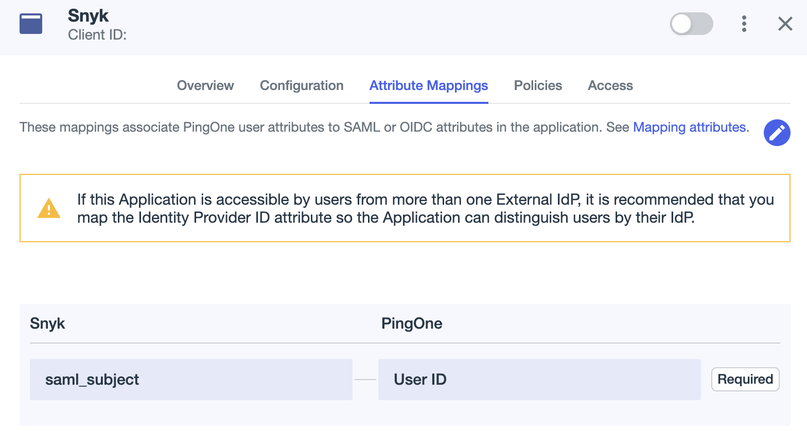
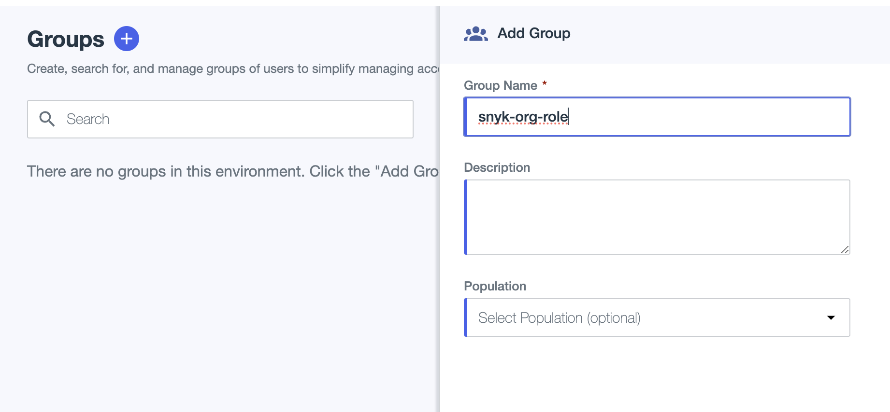



# Example: setting up custom mapping for Ping Identity

This page explains how to configure the custom mapping of roles for Ping Identity using [Legacy custom mapping](../legacy-custom-mapping.md).


This guide assumes your Ping Identity application is configured and functional.



Any step on the Snyk side in setting up the Enterprise application must be performed by your Snyk contact, as self-serve SSO does not accommodate custom mapping.


1.  In your application configuration, select **Attribute mappings** and click the pencil to edit the attributes.

    <figure><figcaption>
Edit mapping attributes
</figcaption></figure>
2.  Select **+Add** and enter the following attribute, then save the change,\
    **roles**: `Group Names`\\

    <figure><figcaption>
Add roles array
</figcaption></figure>
3.  In the left menu, select **Identities/Groups** and add the Snyk Groups needed following the syntax explained on the [Custom mapping](../) page.

    <figure><figcaption>
Adding an example Group
</figcaption></figure>
4. If you do not select a **Population** at the bottom of the previous screen, assign the Group to the users who take part in the role assignment in Snyk. If you select a **Population**, all users in that population inherit the permissions of the assigned Snyk role.
5. To finalize the process, ask your Snyk contact to validate that the SAML payload contains the role array and to turn on the custom mapping feature.

Custom mapping is not active until Snyk turns it on for your Group. After Snyk confirms it is active, the mapping works when a user in a mapped Ping Identity group logs in and receives the Snyk role named in that group, at the scope and target the assertion names.
