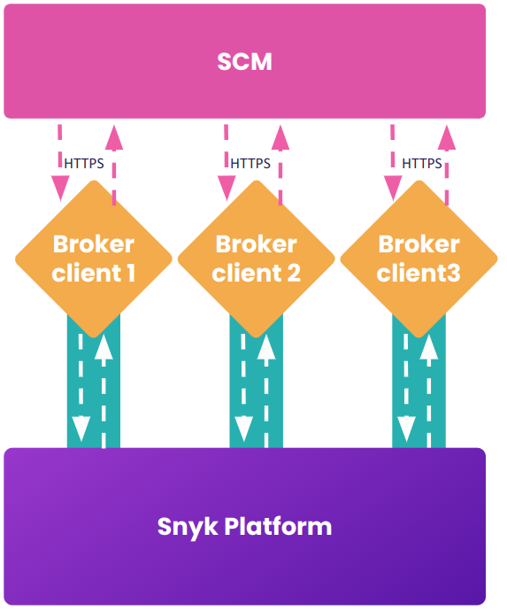

# High availability mode

High availability mode allows you to run several Broker clients that work independently to one another. The Snyk platform will spread the requests it makes evenly across the connections to ease the load on each client and provide redundancy. High availability mode also avoids downtime during Snyk server upgrade events.

<figure><figcaption><p>Operation of multiple Broker clients in high availability</p></figcaption></figure>

For high availability mode, use Docker Compose to run multiple replicas (see [Docker Compose example](universal-broker/running-your-universal-broker-client.md#docker-compose-example)) or by increasing the replica count in your Kubernetes deployment. Each container must have the exact same configuration parameters.

A maximum of four Broker Clients can run concurrently in high availability mode. Running a fifth Broker Client will attempt to connect indefinitely.

## **Important notes about settings**

The Dispatcher Base URL should be specific to your region if you are using a regional Snyk platform, for example, api.eu.snyk.io. See [Regional hosting and data residency](https://app.gitbook.com/o/-M4tdxG8qotLgGZnLpFR/s/ELvljsaLKPkSpffOkmsQ/snyk-data-and-governance/regional-hosting-and-data-residency) for details.

If you are using app.snyk.io, the following is not required. It is applicable only to regional Snyk platforms.

```
BROKER_DISPATCHER_BASE_URL=https://api.snyk.io
```

Outbound connection to api.snyk.io or the corresponding api hostname must be allowed. Otherwise, preflight checks will indicate failure upon Broker client startup.

The `BROKER_CLIENT_URL` value must remain the same across all the Broker clients in the high availability set. The same `BROKER_TOKEN` must also be used.\
It is acceptable for this URL to resolve to a particular client.

The multiple tunnels are primarily supporting Snyk=>You flow. The webhooks going You=>Snyk can take any tunnel as well.

Preferably, Load Balancers can also be introduced. Kubernetes deployment with a service in front of each Broker Client will distribute this automatically.

The following client log lines show the high availability mode is active.

```shellscript
...
checking for HA mode (enabled=true)
received server id (serverId=0)
broker client is connecting to broker server (url=https://broker.snyk.io, serverId=0)
...
```

Using high availability mode introduces the concept of allocated tunnels for each client, scheduling those tunnels across a predictable set of Broker servers so a unique client can be connected to the right pod.
