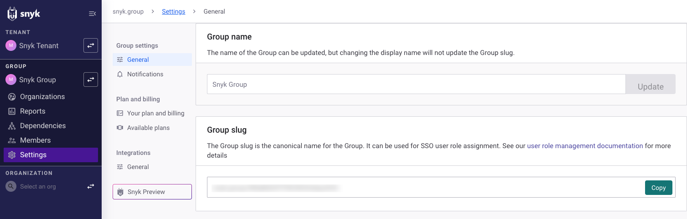

# Group general settings

To view and modify settings for your Group, navigate to **Settings** > **General**.

<figure><figcaption>
Group settings
</figcaption></figure>

In the Group general settings, you can view and modify the following:

* **Group name**: View or modify the name of the Group as displayed in the Snyk Web UI.
* **Group ID**: View and copy the unique ID for this Group. You need this ID when using the [Snyk API](https://app.gitbook.com/s/IEEjSXQQu36y0vmFV8zf/snyk-api/snyk-api).
* **Session expiration**: By default, users are logged out of Snyk after 24 hours of inactivity. You can change the session expiration time for your Group. For details, see [Configure session length for a Snyk Group](configure-session-length-for-a-snyk-group.md) in the user management documentation.
* **Requesting access**: Enable to allow users without access to a Snyk Organization to request access.
  * This is possible only for users who have registered with Snyk and are trying to reach the URL of a specific Project in the Organization, such as from a pull request.
  * This restriction reduces the risk of someone guessing the URL of your Organization.
  * The value set is used as the default for any new Organizations but does not override the **Requesting access** setting for existing Snyk Organizations.
  * For more details, see [Enable the Request Access setting](../organizations/requests-for-access-to-an-organization.md#enable-the-request-access-setting) in the documentation of requests for access to an Organization.
* **Project test frequency**: Set the default test frequency for any new Projects created in this Group. Note that changing the **Project test frequency** setting does not affect the default test frequency of [Snyk Infrastructure as Code](https://app.gitbook.com/s/BJO0IZx7zB6bOkotxQP2/scan-with-snyk/snyk-iac/scan-your-iac-source-code) or [Snyk Code](https://app.gitbook.com/s/BJO0IZx7zB6bOkotxQP2/scan-with-snyk/snyk-code) Projects. The default for both of these is weekly.
