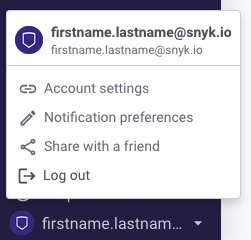
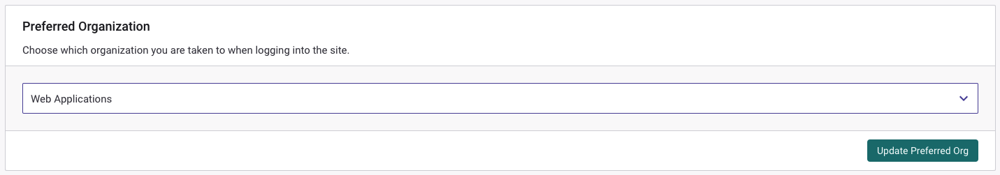

# Set your preferred Organization

## Set your preferred Organization

If you have several Organizations, one of these Organizations is set by default as your **Preferred Organization** in your Snyk account. A Preferred Organization determines the following:

* On the Snyk Web UI: The Organization that is displayed by default when you log in to your Snyk account.
* In the Snyk CLI: The Organization that is used by default for the test count when you scan through the CLI. To change the Organization used for the test count in the CLI, use the\
  `--org=<ORG_ID>` option. For more information, see the CLI help for the test commands: [Snyk test](https://app.gitbook.com/o/-M4tdxG8qotLgGZnLpFR/s/IEEjSXQQu36y0vmFV8zf/snyk-cli/snyk-cli/commandstest), [Snyk Code test](https://app.gitbook.com/o/-M4tdxG8qotLgGZnLpFR/s/IEEjSXQQu36y0vmFV8zf/snyk-cli/snyk-cli/commandscode-test), [Snyk Container test](https://app.gitbook.com/o/-M4tdxG8qotLgGZnLpFR/s/IEEjSXQQu36y0vmFV8zf/snyk-cli/snyk-cli/commandscontainer-test), or [Snyk IaC test](https://app.gitbook.com/o/-M4tdxG8qotLgGZnLpFR/s/IEEjSXQQu36y0vmFV8zf/snyk-cli/snyk-cli/commandsiac-test).

Follow these steps to change your Preferred Organization:

1\. On the Snyk Web UI, click your Account icon at the bottom left corner of the screen. Then click **Account settings**:

<figure><figcaption>
Account settings
</figcaption></figure>

2\. On the **Account Settings** page, in the **Preferred Organization** section, open the Organization dropdown list to display a list of the Organizations to which you have access, and select the Organization you want to set as your Preferred Organization:

<figure><figcaption>
Change your Preferred Organization
</figcaption></figure>

3\. Click the **Update Preferred Org** button to save your new setting.

The Organization you selected as your **Preferred Organization** is displayed when you log in to your Snyk account and used by default for the test count when you scan using the CLI.
