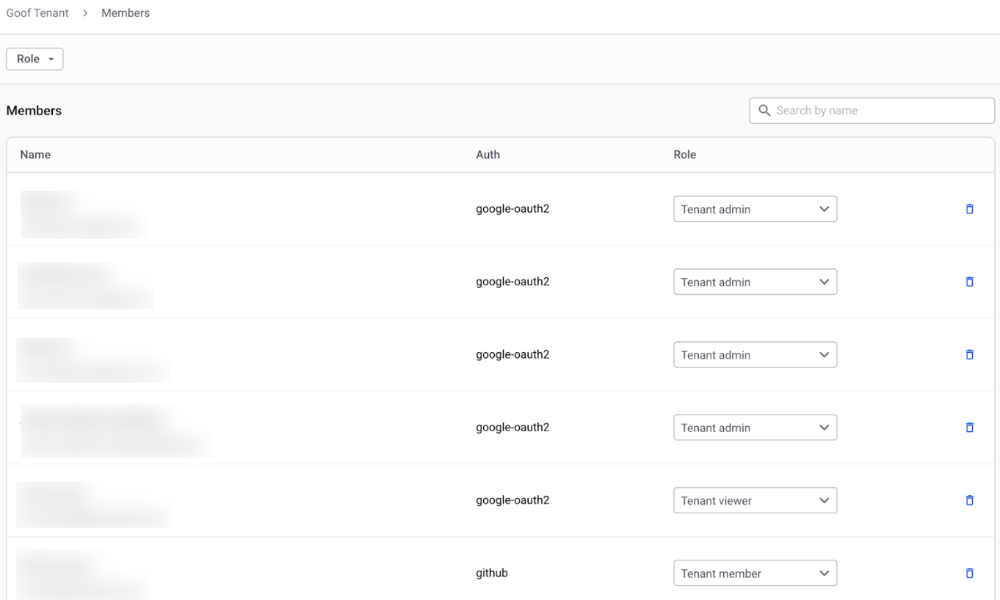

# Tenant


**Feature availability**

Some Tenant features, such as Snyk Analytics, are available only for Enterprise plan customers. For more information, visit [plans and pricing](https://snyk.io/plans/).


A Tenant is the top level of the Snyk hierarchy. It encompasses all your Groups and Organizations and all their corresponding Snyk work items. The Tenant is helpful in organizing access and reporting on the platform when you are a large Enterprise with multiple Groups.

At the Tenant level, you can manage access to features that work across your entire Snyk estate, such as [Snyk Analytics](https://app.gitbook.com/o/-M4tdxG8qotLgGZnLpFR/s/BJO0IZx7zB6bOkotxQP2/manage-risk/analytics) and Members, which allows you to manage users.

Tenant-level roles include **Tenant Admin**, **Tenant Viewer**, and **Tenant Member**. For more information, see [Pre-defined roles](../../user-roles/pre-defined-roles.md#role-types).

## Tenant-level options

You can [manage users of a Tenant](manage-users-in-a-tenant.md) through the **Members** page on the Tenant level.


If you are a member of more than one Tenant, you can switch between them by selecting the Tenant name.



**Snyk 2.0 (Early Access)**

In the Snyk 2.0 UI, you can navigate between different levels of your account (Tenant, Group, and Organization) using the scope selector at the top of the page. When you select a scope, the side menu automatically displays the relevant tools and data for that area.

Snyk 2.0 introduces UI enhancements to the platform navigation and is available in Early Access. This is being rolled out gradually, so not all users see the new navigation at the same time

If you are an existing user, you can switch between the new and classic navigation at any time using the toggle in your user profile menu. For more information, visit [Snyk 2.0 platform improvements](https://app.gitbook.com/o/-M4tdxG8qotLgGZnLpFR/s/L7HyJj9FsK1W4pNt8Gzl/discover-snyk/getting-started/snyk-2.0-platform-improvements).


### Tenant members

To view the users of a Tenant, select **Members**.

Tenant Admins can browse the list of Tenant users, change Tenant level permissions by assigning roles, or remove users.

<figure><figcaption>
Tenant member management list with assigned roles
</figcaption></figure>

See [Manage users in a Tenant](manage-users-in-a-tenant.md) for more details.
