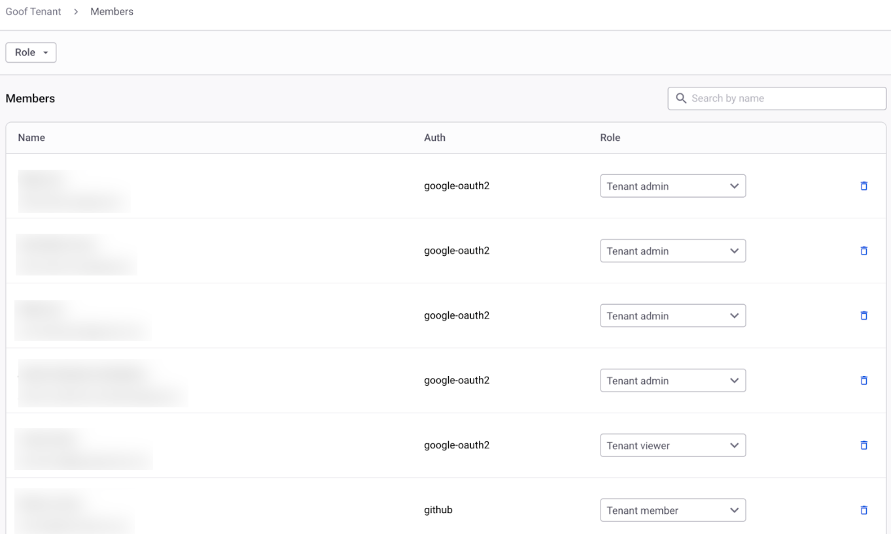

# Tenants


**Feature availability**

Some Tenant features, such as Snyk Analytics, are available only for Enterprise plan customers. For more information, visit [plans and pricing](https://snyk.io/plans/).


A Tenant is the top level of the Snyk hierarchy. It encompasses all your Groups and Organizations and all their corresponding Snyk work items. The Tenant is helpful in organizing access and reporting on the platform when you are a large Enterprise with multiple Groups.

At the Tenant level, you can manage access to features that work across your entire Snyk estate, such as [Snyk Analytics](https://app.gitbook.com/s/BJO0IZx7zB6bOkotxQP2/prevent/analytics) and Members, which allows you to manage users.

Tenant-level roles include **Tenant Admin**, **Tenant Viewer**, and **Tenant Member**. For more information, see [Pre-defined roles](../../user-roles/pre-defined-roles.md#role-types).

## Tenant-level options

You can [manage users of a Tenant](manage-users-in-a-tenant.md) through the **Members** page on the Tenant level.


If you are a member of more than one Tenant, you can switch between them by selecting the Tenant name.


### Tenant members

To view the users of a Tenant, select **Members**.

Tenant Admins can browse the list of Tenant users, change Tenant level permissions by assigning roles, or remove users.

<figure><figcaption>
Tenant member management list with assigned roles
</figcaption></figure>

See [Manage users in a Tenant](manage-users-in-a-tenant.md) for more details.
