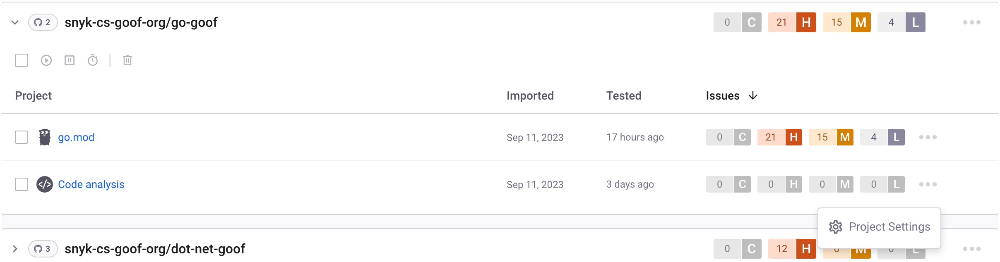
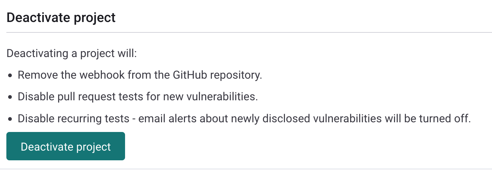
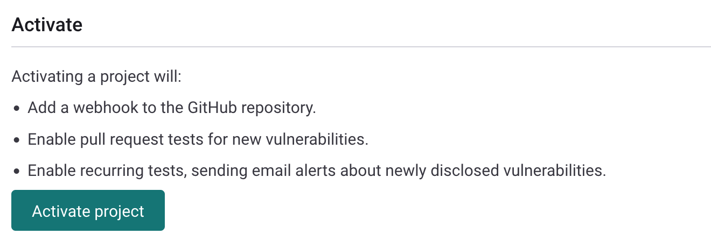

# Remove imported repository from a Project

If you do not want Snyk to continue testing one or more of your imported repositories, you can do one of the following:

* Remove the entire repository from your Snyk Account in one of the following ways:
  * Deactivate the repository.
  * Delete the repository from your Snyk Account.


If you remove the entire repository from your Account, no Snyk product analyzes your repository any longer.


* Remove only the **Code analysis** Project from your Snyk Account in one of the following ways:
  * Deactivate the Project.
  * Delete the Project from your Snyk Account.


If you remove only the **Code analysis** Project, other Snyk products that are enabled in your account continue to analyze the imported repository.


## **Remove imported repository methods**

To select the right method for removing repositories from Snyk testing, consider what happens in each of the following actions:

* Deactivating an imported repository does the following:
  * Removes the webhook from Snyk to the SCM repository.
  * Disables pull request tests for new vulnerabilities.
  * Disables the Fix Pull Requests option from being opened for newly discovered vulnerabilities.
  * Disables recurring tests and turns off email alerts about newly discovered vulnerabilities.
* Deleting a Snyk Project or an imported repository does the following:
  * Deletes the entire Project or repository and all its historical snapshot data from Snyk.
  * Removes the webhook from the SCM repository.


Deleting a Snyk Project or an imported repository does not have any effect on your source code.

If you want to remove specific directories or files from the Snyk Code test, use [the exclude option in the `.snyk` file](exclude-directories-and-files-from-project-import.md).


## **Deactivate and delete imported repositories**

For instructions on deleting repositories, see the Project actions [Delete, Activate, or Deactivate](../../snyk-platform-administration/snyk-projects/#delete-activate-or-deactivate). For more details, see [How can I delete multiple Projects](https://support.snyk.io/s/article/How-can-I-delete-multiple-projects)?

## **Deactivate and delete a Snyk Code Project**

To stop Snyk Code from testing an imported repository, you can either deactivate or delete the **Code analysis** Project in the repository. The **Code analysis** Project is no longer active in the repository, and Snyk Code stops testing the repository, but other Snyk products continue to scan the repository files.

Follow these steps to deactivate or delete the Code analysis Project:

1\. On the **Projects** page, locate the repository you want Snyk Code to stop testing. In its Target folder, locate the **Code analysis** Project, and click the three dots, then click on **Project** **Settings:**

<figure><figcaption>
Project Settings button for Code analysis Project
</figcaption></figure>

2\. On the **Settings** page of the **Code analysis** Project, click either **Deactivate project** or **Delete project**, depending on what you want to do.

<figure><figcaption>
Deactivate project on Code analysis Project Settings page
</figcaption></figure>


Deactivating a Project keeps it on the **Projects** page along with the issues count from the last scan, which contributes to the Target-level aggregate when Projects are grouped by Target. Deleting the Project removes all values from the page.


The **Code analysis** Project you selected is either deactivated or deleted, and Snyk Code no longer tests its repository.

If you want Snyk Code to resume its testing after you delete or deactivate the **Code analysis** Project of a repository, do the following:

* After deleting the Code analysis Project, re-import the repository to Snyk and then refresh the **Projects** page to view the results of the re-import.
* After deactivating the Code analysis Project, re-activate the **Code analysis** Project through the **Settings** page of the Project. After you deactivate a Project, the **Deactivate project** button changes to **Activate project**, and a new **Activate** button appears at the top of the page. Click one of these buttons to re-activate the Project:

<figure><figcaption>
Activate project button on Code analysis Project Settings page
</figcaption></figure>
