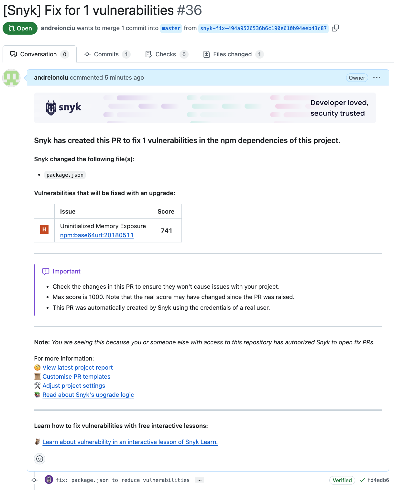
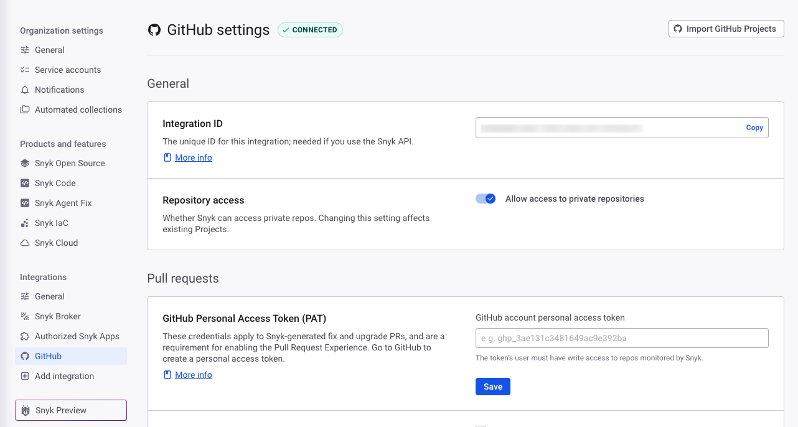
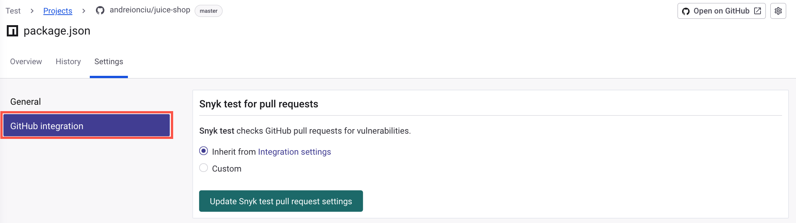
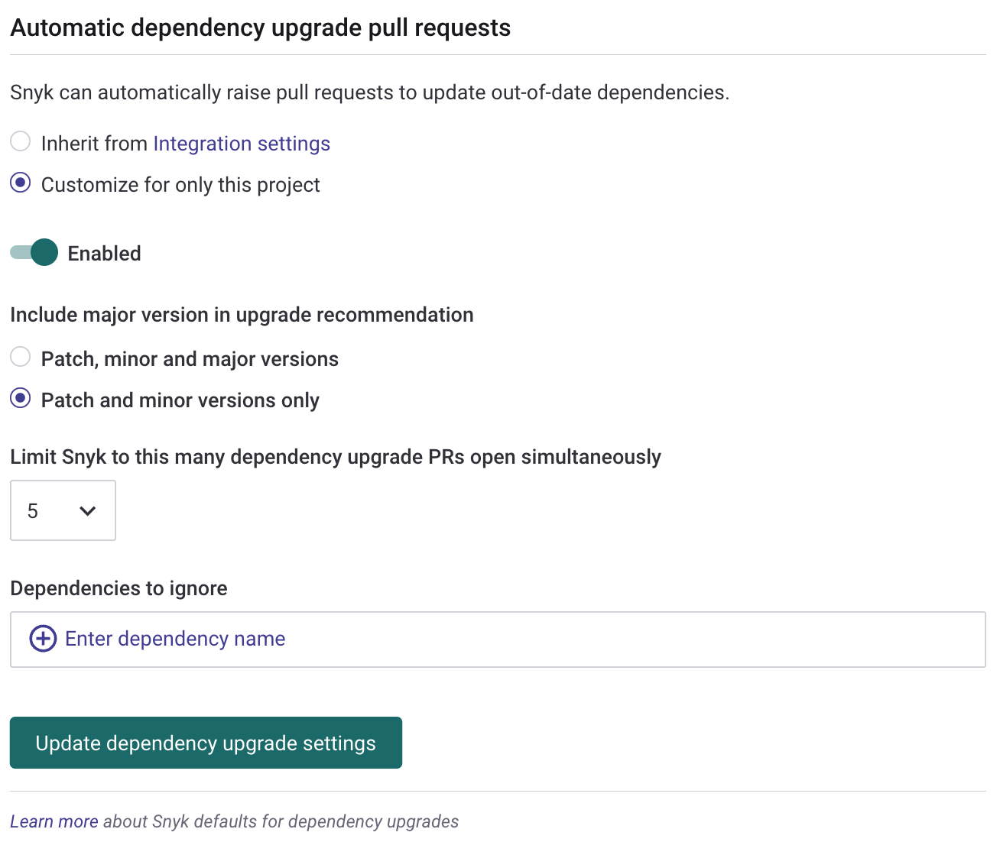

# Enable automatic upgrade PRs for new dependency upgrades


**Feature availability**

This feature is supported for the following SCM integrations: GitHub, GitHub Enterprise, GitHub Cloud App, Bitbucket Server, Bitbucket Cloud, Bitbucket Connect, GitLab, and Azure Repos.


Keeping dependencies up-to-date is crucial for security, performance, and compatibility. Snyk simplifies the process by scanning Projects for outdated dependencies and proposing updates through automated pull requests. This allows teams to:

* Review and merge changes in a controlled, systematic manner.
* Keep their ecosystem and Projects updated with the latest versions of packages.
* Automate testing to ensure new updates do not break existing functionality.

If you use Snyk to update your open source and private dependencies, you can keep your Projects up to date with minimal manual intervention, reduce the risk of security vulnerabilities, and improve the overall quality of the software. More than that, you'll always be aware of newer versions for the packages you use and make progressive effort to use the latest ones, in advance to when such upgrades become a non negotiable.

## Defining automatic upgrade PRs

Automatic dependency or upgrade PRs work as follows.

1. The **Automatic dependency upgrade pull requests** option must be enabled in [the Integration Settings at the Organization level](enable-automatic-upgrade-prs-for-new-dependency-upgrades.md#how-to-enable-the-automatic-dependency-upgrade-prs-option-for-an-entire-organization) or in the Project Settings.
2. When you import repositories, Snyk scans the repositories and provides scan results. Snyk then continues to monitor your Open Source Projects, scanning them on a regular basis. The re-scan frequency is based on the schedule set in the Project Settings.
3. For each scan, when new versions for your dependencies are identified, Snyk creates automatic upgrade PRs.
   * Snyk opens separate PRs for each dependency
   * By default, Snyk does not create upgrade PRs for a Project that has five or more open Snyk PRs. After the limit of open PRs is reached, no new PRs are created. This limit can be set on the Integration or Project Settings to be between 1-10. This limit applies only to Upgrade PRs, and it does consider Fix PRs and Backlog PRs in this count. Automatic Fix PRs are not limited in this way.
   * By default, Snyk only recommends minor upgrades through automatic Upgrade PRs. However, recommendations for major version upgrades can be turned on in **Settings.**
   * If the latest eligible version contains vulnerabilities that are not found yet in your Project, Snyk does not recommend an upgrade.
   * Snyk does not recommend upgrades to versions that are less than 21 days ol&#x64;_._ Snyk finds that app versions under this threshold have the highest risk of introducing unknown functional bugs and have the greatest likelihood of becoming unpublished or being released from a compromised account.

## Supported languages and SCMs

Automatic dependency upgrades are supported for [certain package managers](../../snyk-open-source/manage-vulnerabilities/troubleshoot-fixing-vulnerabilities-with-snyk-open-source.md) and repositories with the following Source Control Managers (SCMs): GitHub, GitHub Enterprise, GitHub Cloud App, Bitbucket Server, Bitbucket Cloud, Bitbucket Connect, GitLab, and Azure Repos.

You can also use this feature with Snyk Broker. To use this feature, you must upgrade Snyk Broker to v. 1.4.55.0 or later. For more information, see [Upgrade the Snyk Broker client](https://app.gitbook.com/s/IgtgtomLQ2TUgSKOMSAm/snyk-broker/update-the-snyk-broker-client).

## Enabling automatic upgrade PRs

After importing a Git repository, Snyk continuously monitors for vulnerabilities, license, and dependency health issues. In addition to fix advice through the web UI, Snyk can automatically create pull requests (PRs) to solve for a variety of vulnerability types according to your configuration settings.

<figure><figcaption>
Snyk conversation card in GitHub reporting PR raised
</figcaption></figure>

You can configure Snyk to regularly check your dependency health, recommend dependency upgrades, and automatically submit PRs for upgrades for either an entire Organization or a specific Project. After configuration, Snyk will automatically create PRs for all applicable dependencies as upgrades become available for scanned Projects.


Automatic dependency upgrade PRs are available only for the following SCM integrations: GitHub, GitHub Enterprise, and Bitbucket Cloud.


### How to enable the automatic upgrade PRs option for an Organization

Project Settings inherit Organization Settings until they are explicitly changed on the Project Settings page. To force push Project Setting overrides at the Group level, they must be re-saved with the option "Apply changes to all overridden projects."

To enable Automatic Upgrade PRs across an entire Organization, follow these steps:

1. In the Snyk web UI, open the desired Organization.
2. Navigate to **Settings** > **Organization settings**. Find and click your configured SCM in the **Integrations** sidebar.

<figure><figcaption>
Edit integration settings
</figcaption></figure>

3. On the **Settings** page of the selected integration, navigate to the **Automatic dependency upgrade PRs** section.
4. In this section, perform the following actions:
   * Slider - change to **Enable**.
   * **Maximum number of open upgrade PRs allowed** – define how many open Snyk PRs (fix, upgrade, and backlog) a Project can have to also receive a dependency upgrade PR; the maximum is ten. When the limit of the open PRs is reached, no new upgrade PRs are created.
   * **Include major version in upgrade recommendation** – select whether to include major version upgrades in the recommendations. By default, only patches and minor versions are included in the upgrade recommendations.
   * **Dependencies to ignore** – enter the exact name of the dependencies that should NOT be included in the **Automatic upgrade** operation. You can only enter lowercase letters.

<figure><figcaption>
Enabling Automatic dependency upgrade PFs
</figcaption></figure>

5. To save and apply your changes, select one of the following from the **Save** dropdown:
   * **Save** – your changes are saved and will be applied to all the Projects in the Organization that are configured to inherit these Settings from the Organization. Projects that have Custom Settings will not be influenced by this change.
   * **Save changes and apply to all overridden Projects** – your changes are saved and will be applied to all the Projects in the Organization. Projects that have Custom Settings will inherit these Organization Settings, and their Custom Settings will be overridden.

From now on, every time Snyk scans any Project in the Organization, it automatically submits Upgrade PRs if the scan discovers that an upgrade is available.

If a newer version is released for an existing Snyk Upgrade PR, or for an existing Fix PR, the existing PR must be closed or merged before Snyk can raise a new PR.

### How to enable the automatic upgrade PRs option for a Project

The Settings on the Project level typically override the Settings on the Organization level. If an Organization owner forces settings overrides, Project users need to reconfigure their settings. We recommend alignment between Project and Organization owners to avoid situations like this.

Follow these steps to configure automatic upgrade PRs for a specific Project:

1. From the Snyk web UI, open the Organization that includes the Project you want to configure.
2. In the list of Projects, locate and expand the **Project** for which you want to enable automatic upgrade PRs.
3. Click the **Project settings** at the end of the Project row.
4. On the **Project** **Settings** page, select the integration you are using.

<figure><figcaption>
Project Settings - Select the integration you are using
</figcaption></figure>

5. On the **Integration** page, scroll to the **Automatic dependency upgrade pull requests** section and choose one of the following:
   * **Inherit from Integration settings** – apply the Integration Settings of the Organization to the selected Project.\
     If the **Automatic dependency upgrade PRs option is disabled for the Organization**, this option will also be disabled for the Project.
   * **Customize for only this Project** – apply specific settings of the **Automatic dependency upgrade PRs** option on the Project. If you select this option:
     * Change the slider to **Enabled**.
     * In **Include major version in upgrade recommendation,** select one of the available options to define whether major version upgrades will be included in the recommendations.\
       By default, only patches and minor versions are included in the upgrade recommendations.
     * In **Limit Snyk to this many dependency upgrade PRs open simultaneously,** define how many open Snyk PRs a Project can have to receivee also a dependency upgrade PR. You can set a number between 1 and 10.\
       When the limit of the open PRs is reached, no new upgrade PRs are created.\
       By default, to _also_ receive a dependency upgrade PR, a Project can have _up to four_ open PRs.
     * In **Dependencies to ignore**, enter the exact name of the dependencies to _exclude_ from the **Automatic upgrade** operation.\
       You can only enter lowercase letters.
     * Click **Update dependency upgrade settings** to save your changes.

<figure><figcaption>
Automatic dependency upgrade pull requests settings at the Project level
</figcaption></figure>

After you have completed these steps, Snyk scans the Project and automatically submits Upgrade PRs if the scan discovers that an upgrade is available. If a newer version is released for an existing Snyk Upgrade PR or an existing Fix PR, the existing PR must be closed or merged before Snyk can raise a new PR.
