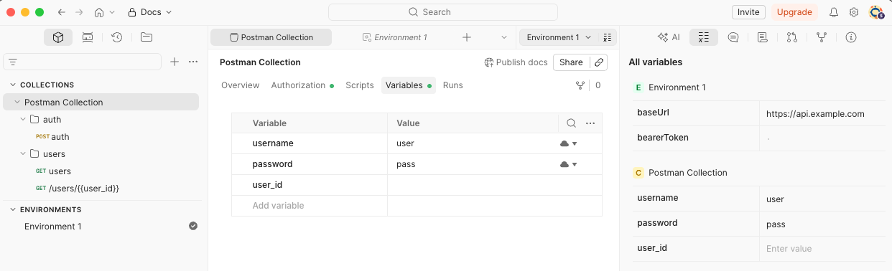
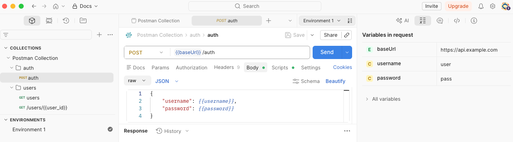
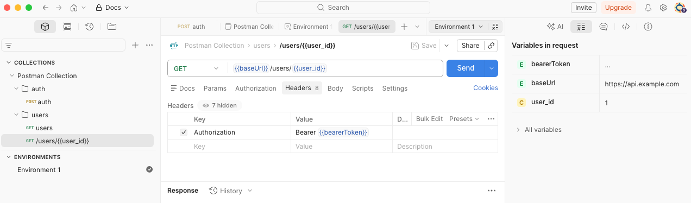

# Configure Postman Collection targets

Use Postman Collections to define API endpoints for scanning with Snyk API & Web.

Configure Snyk API & Web to scan API endpoints using a Postman Collection. The configuration involves three main steps:

1. Prepare the Postman Collection
2. Configure an API target using the Postman Collection
3. Configure the API target with Postman environment variables

## Example scenario

This example uses a Postman Collection with the following requests:

* **Authenticate and obtain an authentication token** - requires a username and password in the request body.
* **Get a list of users** - requires the authentication token in the request header.
* **Get user details** - requires the authentication token in the request header and the user identifier as a parameter.

## Prepare the Postman Collection

Prepare the Postman Collection to run the sequence of requests from start to end without errors. This ensures a clean export for configuring an API target in Snyk API & Web.

### Create variables

1.  Navigate to the **Variables** tab of the collection to create auxiliary variables:

    * `username`: hard-coded value of the username to obtain the token.
    * `password`: hard-coded value of the password to obtain the token.
    * `user_id`: value to get user details by ID. Leave the value as null because the script sets it dynamically.

    <div data-gb-custom-block data-tag="hint" data-style="info" class="hint hint-info"><p>Set the <code>username</code> and <code>password</code> variables as <strong>Shared</strong>, so that the exported collection contains their hard-coded values. Set the <code>user_id</code> variable as <strong>Unshared</strong>, because the script sets the value dynamically.</p></div>
2. Navigate to **Environments** to create the variable for storing the authentication token, and other variables that you set in Snyk API & Web:
   * `bearerToken`: variable to store the authentication token. Leave the value as null because the script sets it dynamically.
   * `baseUrl`: hard-coded value of the API URL.

Your collection and environment variables look like the following example:

<figure><figcaption></figcaption></figure>

### Configure the authentication request

1.  To obtain the authentication token, navigate to the authentication request and set the payload in the **Body** tab with the `username` and `password` variables.

    <figure><figcaption></figcaption></figure>
2.  To set the returned authentication token in the `bearerToken` variable, navigate to the **Scripts** tab of the authentication request and add the following JavaScript in the **Post-response**:

    ```javascript
    var jsonData = pm.response.json();  
    pm.environment.set('bearerToken', jsonData.access_token);
    pm.test("response has the access token", function() {
       pm.expect(jsonData).to.have.property('access_token');
    });
    ```
3. After the token is configured, add the `bearerToken` variable to all requests in the **Headers** tab.

### Configure request parameters

In this example, the request to obtain user details requires the user identifier as a parameter.

1.  To set the returned value in the `user_id` variable, navigate to the **Scripts** tab of the users request and add the following JavaScript in the **Post-response**:

    ```javascript
    var jsonData = pm.response.json();  
    pm.collectionVariables.set('user_id', jsonData.results[0].id);
    ```
2. Navigate to the request that gets the user details and add the `user_id` variable as a parameter.

The following image shows an example of a request to get user details.

<figure><figcaption></figcaption></figure>

### Test and export the collection

With all requests configured, run the collection to test it. If there are no issues, export the collection.

## Add a Postman Collection target

After the Postman Collection is prepared and exported, add an API target.

1. Navigate to **Targets** and click **Add**.
2. Complete the **Add target** form:
   * **Name**: Enter a meaningful identifier for your target.
   * **URL**: Enter the base URL for your API.
   * **API Type**: Select **API**, then select **Postman Collection**.
   * Select **Schema file upload**.
   * **File**: Choose the file exported from Postman.
3. Click **Add**.

## Configure Postman environment variables

This example added two variables to **Environments**: `baseUrl` and `bearerToken`. Because the `baseUrl` was hard-coded in Postman, you must also set its value in Snyk.


For security reasons, set the `password` variable using the [credentials manager](../configure-authentication/manage-credentials.md). Variables added to **Environments** take precedence over the variables added in the collection.


### Manual configuration

Configure environment variables manually in the user interface:

1. Navigate to the target **Settings**.
2. In the **Scanner** section, select **API SCANNING SETTINGS**.
3. Enter the required Postman environment variables in the corresponding fields.

### Automated configuration using script

Alternatively, import environment variables using an automated script:

1. In Postman, export the Postman environment to a file.
2. Retrieve the Python script to import Postman environment variables into Snyk. Find this script on the [Probely API Scripts GitHub page](https://github.com/Probely/API_Scripts/blob/master/import_postman_env.py).
3. Run the Python script and enter the following values:
   * **Target ID**: The Snyk identifier of the API target, which you find in the URL of the API target. For example, the target ID in `https://plus.probely.app/targets/2yzxnYgwmqbd` is `2yzxnYgwmqbd`.
   * **Postman collection file**: The file exported from Postman containing the environment variables.
4. Navigate to the **Postman Environment Values** section of the API target to see the newly added environment variables.

## Verify the configuration

After configuration is complete, the target is ready to scan. [Test your configuration](../test-target-configuration.md) and then run a scan to verify that all requests in the collection are tested.


In this example, the authentication request to set the `bearerToken` is the first in the list of the collection, so the scan can run all the requests. For production scenarios, Snyk recommends that you [configure Postman authentication](../configure-authentication/configure-postman-authentication.md) and enable **API TARGET AUTHENTICATION** and **LOGOUT DETECTION** in Snyk.

